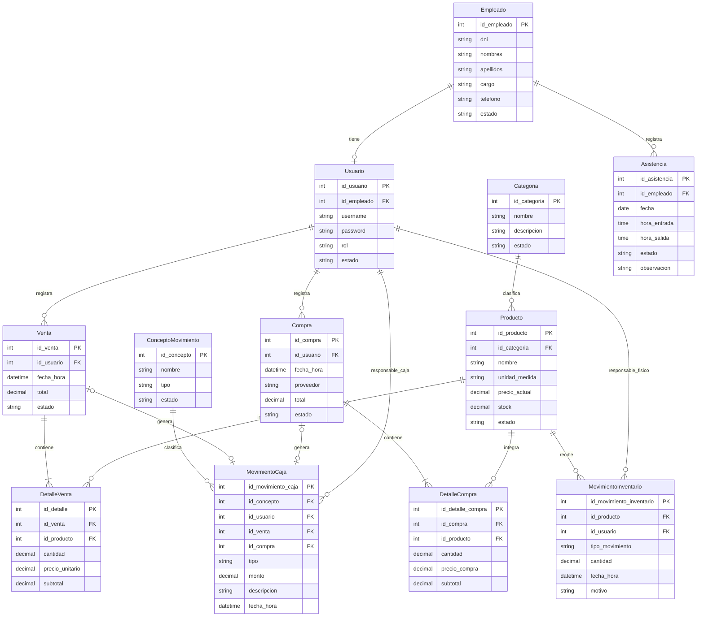

# Modelo entidad relación

Doce entidades oficiales. Modelo conceptual preparado para Spring Boot; no existe esquema de base de datos implementado. PK identifica el registro; FK referencia una entidad.

## Categoria

| Atributo | Clave / condición | Descripción |
|---|---|---|
| id_categoria | PK | Identificador de Categoria |
| nombre | Atributo | Nombre |
| descripcion | Atributo | Descripcion |
| estado | Atributo | Situación del registro según su ciclo de vida. |

Relaciones: Categoria → Producto (1:N).

## Producto

| Atributo | Clave / condición | Descripción |
|---|---|---|
| id_producto | PK | Identificador de Producto |
| id_categoria | FK | Referencia a Categoria |
| nombre | Atributo | Nombre |
| unidad_medida | Atributo | Litro en esta maqueta. |
| precio_actual | Atributo | Precio actual de venta al litro |
| stock | Atributo | Saldo físico en litros, coherente con movimientos. |
| estado | Atributo | Situación del registro según su ciclo de vida. |

Relaciones: Categoria → Producto (1:N); Producto → DetalleVenta (1:N); Producto → DetalleCompra (1:N); Producto → MovimientoInventario (1:N).

## Compra

| Atributo | Clave / condición | Descripción |
|---|---|---|
| id_compra | PK | Identificador de Compra |
| id_usuario | FK | Referencia a Usuario responsable del registro |
| fecha_hora | Atributo | Fecha hora |
| proveedor | Atributo | Nombre del proveedor; es un atributo de texto, no una entidad. |
| total | Atributo | Suma de subtotales de la compra. |
| estado | Atributo | Pendiente / Confirmada en esta maqueta. |

Relaciones: Usuario → Compra (1:N); Compra → DetalleCompra (1:N); Compra → MovimientoCaja (1:0..1).

## DetalleCompra

| Atributo | Clave / condición | Descripción |
|---|---|---|
| id_detalle_compra | PK | Identificador de DetalleCompra |
| id_compra | FK | Referencia a Compra |
| id_producto | FK | Referencia a Producto |
| cantidad | Atributo | Cantidad positiva en litros recibidos. |
| precio_compra | Atributo | Precio de adquisición por litro en el momento de la compra. |
| subtotal | Atributo | cantidad × precio_compra. |

Relaciones: Compra → DetalleCompra (1:N); Producto → DetalleCompra (1:N).

## Empleado

| Atributo | Clave / condición | Descripción |
|---|---|---|
| id_empleado | PK | Identificador de Empleado |
| dni | Atributo | Identificador ficticio en maqueta; cadena de 8 caracteres. |
| nombres | Atributo | Nombres |
| apellidos | Atributo | Apellidos |
| cargo | Atributo | Cargo |
| telefono | Atributo | Telefono |
| estado | Atributo | Situación del registro según su ciclo de vida. |

Relaciones: Empleado → Usuario (1:0..1); Empleado → Asistencia (1:N).

## Usuario

| Atributo | Clave / condición | Descripción |
|---|---|---|
| id_usuario | PK | Identificador de Usuario |
| id_empleado | FK | Referencia a Empleado |
| username | Atributo | Username |
| password | Atributo | Hash de contraseña en la futura implementación; nunca texto plano. |
| rol | Atributo | Rol |
| estado | Atributo | Situación del registro según su ciclo de vida. |

Relaciones: Empleado → Usuario (1:0..1); Usuario → Venta (1:N); Usuario → Compra (1:N); Usuario → MovimientoInventario (1:N); Usuario → MovimientoCaja (1:N).

## Venta

| Atributo | Clave / condición | Descripción |
|---|---|---|
| id_venta | PK | Identificador de Venta |
| id_usuario | FK | Referencia a Usuario |
| fecha_hora | Atributo | Fecha hora |
| total | Atributo | Suma de subtotales de la venta. |
| estado | Atributo | Situación del registro según su ciclo de vida. |

Relaciones: Usuario → Venta (1:N); Venta → DetalleVenta (1:N); Venta → MovimientoCaja (1:0..1).

## DetalleVenta

| Atributo | Clave / condición | Descripción |
|---|---|---|
| id_detalle | PK | Identificador de DetalleVenta |
| id_venta | FK | Referencia a Venta |
| id_producto | FK | Referencia a Producto |
| cantidad | Atributo | Cantidad positiva en litros. |
| precio_unitario | Atributo | Precio histórico aplicado al detalle, independiente del precio actual. |
| subtotal | Atributo | cantidad × precio_unitario. |

Relaciones: Venta → DetalleVenta (1:N); Producto → DetalleVenta (1:N).

## MovimientoInventario

| Atributo | Clave / condición | Descripción |
|---|---|---|
| id_movimiento_inventario | PK | Identificador de MovimientoInventario |
| id_producto | FK | Referencia a Producto |
| id_usuario | FK | Referencia a Usuario |
| tipo_movimiento | Atributo | Entrada o Salida de combustible. |
| cantidad | Atributo | Cantidad positiva en litros. |
| fecha_hora | Atributo | Fecha hora |
| motivo | Atributo | Motivo; en esta maqueta documenta la referencia, por ejemplo "Compra C001" o "Venta V001". |

Relaciones: Producto → MovimientoInventario (1:N); Usuario → MovimientoInventario (1:N).

## ConceptoMovimiento

| Atributo | Clave / condición | Descripción |
|---|---|---|
| id_concepto | PK | Identificador de ConceptoMovimiento |
| nombre | Atributo | Nombre |
| tipo | Atributo | Ingreso o Egreso. |
| estado | Atributo | Situación del registro según su ciclo de vida. |

Relaciones: ConceptoMovimiento → MovimientoCaja (1:N).

## MovimientoCaja

| Atributo | Clave / condición | Descripción |
|---|---|---|
| id_movimiento_caja | PK | Identificador de MovimientoCaja |
| id_concepto | FK | Referencia a ConceptoMovimiento |
| id_usuario | FK | Referencia a Usuario |
| id_venta | FK opcional | Referencia a Venta |
| id_compra | FK opcional | Referencia a Compra |
| tipo | Atributo | Ingreso o Egreso. |
| monto | Atributo | Importe positivo en soles. |
| descripcion | Atributo | Descripcion |
| fecha_hora | Atributo | Fecha hora |

Relaciones: ConceptoMovimiento → MovimientoCaja (1:N); Venta → MovimientoCaja (1:0..1); Compra → MovimientoCaja (1:0..1); Usuario → MovimientoCaja (1:N).

## Asistencia

| Atributo | Clave / condición | Descripción |
|---|---|---|
| id_asistencia | PK | Identificador de Asistencia |
| id_empleado | FK | Referencia a Empleado |
| fecha | Atributo | Día de la marcación (DATE). |
| hora_entrada | Atributo | Hora de entrada de la jornada (TIME). |
| hora_salida | Atributo | Hora de salida de la jornada (TIME); debe ser posterior a la hora de entrada. |
| estado | Atributo | Presente o Falta; se calcula a partir de las horas (ENUM). |
| observacion | Atributo opcional | Nota de la marcación, p. ej. motivo de una falta; admite nulo (VARCHAR 120). |

Relaciones: Empleado → Asistencia (1:N).

Interfaces asociadas: P28 (Mi asistencia) y P29 (Control de asistencia).

## Relaciones y cardinalidades

- **Categoria 1:N Producto**: Cada producto pertenece a una categoría; una categoría puede agrupar muchos productos. Ejemplo: Gasolinas → Gasolina Regular y Gasolina Premium; Diésel → Diésel.
- **Empleado 1:0..1 Usuario**: Un empleado puede no tener cuenta; cada usuario tiene un empleado, con id_empleado único.
- **Usuario 1:N Venta**: Un usuario registra muchas ventas; cada venta tiene un usuario responsable.
- **Usuario 1:N Compra**: Un usuario registra muchas compras; cada compra tiene un usuario responsable.
- **Compra 1:N DetalleCompra**: Una compra confirmada tiene al menos un detalle; cada detalle pertenece a una compra.
- **Producto 1:N DetalleCompra**: Un producto aparece en muchas compras; cada detalle identifica un producto.
- **Venta 1:N DetalleVenta**: Una venta confirmada tiene al menos un detalle; cada detalle pertenece a una venta.
- **Producto 1:N DetalleVenta**: Un producto aparece en muchos detalles; cada detalle identifica un producto.
- **Producto 1:N MovimientoInventario**: Un producto tiene muchos movimientos; cada movimiento corresponde a un producto.
- **ConceptoMovimiento 1:N MovimientoCaja**: Un concepto clasifica muchos movimientos; cada movimiento tiene un concepto.
- **Venta 1:0..1 MovimientoCaja**: Una venta tiene cero o un movimiento asociado; al confirmarse exige uno de ingreso por RN05. Los movimientos manuales y los de compra no tienen venta.
- **Compra 1:0..1 MovimientoCaja**: Una compra tiene cero o un movimiento asociado; al confirmarse exige exactamente un egreso por su total por RN04.
- **Usuario 1:N MovimientoInventario**: Relación adicional derivada de id_usuario: identifica al responsable del movimiento físico.
- **Usuario 1:N MovimientoCaja**: Relación adicional derivada de id_usuario: identifica al responsable del movimiento económico.
- **Empleado 1:N Asistencia**: Un empleado tiene muchas marcaciones; cada marcación pertenece a un solo empleado (RN07). Ejemplo: Ana Torres, 10/09/2026, 08:00–17:00, Presente.

## Condiciones de diseño futuro
- Unicidad de Usuario.id_empleado (un usuario por empleado), username y DNI. No son funcionalidades adicionales.
- MovimientoCaja.id_venta e id_compra admiten nulo para movimientos manuales y serán únicos cuando tengan valor. En venta confirmada RN05 exige exactamente un ingreso por su total; en compra confirmada RN04 exige exactamente un egreso por su total.
- Producto.precio_actual, DetalleVenta.precio_unitario, DetalleCompra.precio_compra, subtotales, Venta.total, Compra.total y monto usarán decimales exactos; cantidades y stock también admitirán fracciones. No usar punto flotante para dinero.
- Producto.stock y MovimientoInventario deben cambiar de forma atómica; RN01 requiere controlar concurrencia.
- Estados de catálogos: Activo / Inactivo. Venta y Compra: Pendiente / Confirmada en esta maqueta. Asistencia: Presente / Falta según RN10.
- Unicidad de Asistencia (id_empleado, fecha) por RN08; el estado se calcula a partir de las horas por RN10.
- Con las 12 entidades oficiales no se añade ninguna otra. El proveedor es un atributo de texto de Compra; las capacidades y el umbral visual de stock no son atributos base persistentes.
- En relaciones 1:N se permite cero registros dependientes antes de operar; Venta y Compra confirmadas exigen uno o más detalles.

## Diagrama ER (solo documentación)

## Conteo

| Entidad | Presente |
|---|---|
| Categoria | ✔ |
| Producto | ✔ |
| Compra | ✔ |
| DetalleCompra | ✔ |
| Empleado | ✔ |
| Usuario | ✔ |
| Venta | ✔ |
| DetalleVenta | ✔ |
| MovimientoInventario | ✔ |
| ConceptoMovimiento | ✔ |
| MovimientoCaja | ✔ |
| Asistencia | ✔ |

**Total: 12 entidades.**

**Diccionario: 74 atributos, 12 PK, 15 FK y 15 relaciones.**
