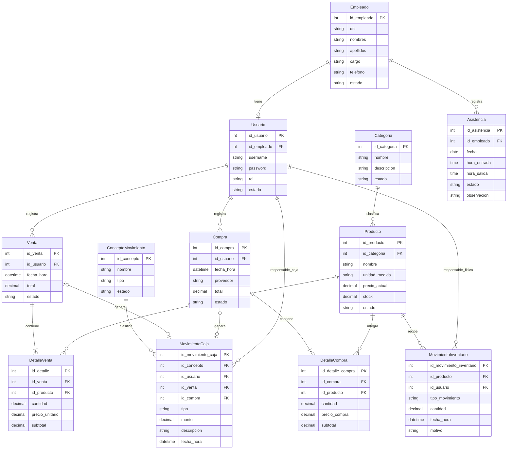

# Modelo entidad relación · Estación Nexo

Estación Nexo se modela con **12 entidades**: Categoria, Producto, Compra, DetalleCompra, Empleado, Usuario, Venta, DetalleVenta, MovimientoInventario, ConceptoMovimiento, MovimientoCaja y Asistencia. PK identifica el registro; FK referencia a otra entidad. Este documento es además el **diccionario de datos** completo del proyecto: 74 atributos con su tipo, su obligatoriedad y su significado dentro de Estación Nexo. La versión actual guarda estos datos en memoria (listas `List<T>` en los servicios); no existe esquema de base de datos implementado.

Leyenda de obligatoriedad: **Obligatoria** = el registro siempre tiene valor; **Opcional** = puede quedar vacía; **Calculada** = se obtiene de otros atributos del mismo registro.

## Tabla resumen

| Entidad | Propósito | PK | FK | Relaciones |
|---|---|---|---|---|
| Categoria | Familias de combustible (Gasolinas, Diésel) | id_categoria | — | 1:N con Producto |
| Producto | Combustible del catálogo con precio, stock y estado | id_producto | id_categoria | 1:N con DetalleCompra, DetalleVenta, MovimientoInventario |
| Compra | Abastecimiento a proveedor con su total | id_compra | id_usuario | 1:N con DetalleCompra; 1:0..1 con MovimientoCaja |
| DetalleCompra | Línea de una compra: producto, litros, precio | id_detalle_compra | id_compra, id_producto | N:1 con Compra y Producto |
| Empleado | Personal de la estación con cargo y estado | id_empleado | — | 1:0..1 con Usuario; 1:N con Asistencia |
| Usuario | Cuenta de acceso de un empleado con rol | id_usuario | id_empleado | 1:N con Venta, Compra, MovimientoInventario, MovimientoCaja |
| Venta | Venta de combustible con su total | id_venta | id_usuario | 1:N con DetalleVenta; 1:0..1 con MovimientoCaja |
| DetalleVenta | Línea de una venta: producto, litros, precio | id_detalle | id_venta, id_producto | N:1 con Venta y Producto |
| MovimientoInventario | Entrada o salida física de litros | id_movimiento_inventario | id_producto, id_usuario | N:1 con Producto y Usuario |
| ConceptoMovimiento | Clasificación económica de la caja (CE01, CE02) | id_concepto | — | 1:N con MovimientoCaja |
| MovimientoCaja | Ingreso o egreso de dinero con su origen | id_movimiento_caja | id_concepto, id_usuario, id_venta*, id_compra* | N:1 con ConceptoMovimiento y Usuario; 1:0..1 con Venta y Compra |
| Asistencia | Jornada diaria del personal (entrada, salida, estado) | id_asistencia | id_empleado | N:1 con Empleado |

`*` id_venta e id_compra son opcionales porque un movimiento sólo de caja no existe en Estación Nexo: todo movimiento nace de una venta o de una compra.

## Categoria

Definición: familia que agrupa combustibles. Gasolinas agrupa Gasolina Regular y Gasolina Premium; Diésel agrupa el Diésel.

| Atributo | Tipo | Clave | Obligatoriedad | Descripción en Estación Nexo |
|---|---|---|---|---|
| id_categoria | INT | PK | Obligatoria | Identificador de la categoría (1, 2, 3). |
| nombre | VARCHAR | — | Obligatoria | Nombre de la familia («Gasolinas», «Diésel»); es el campo que exige el formulario de alta. |
| descripcion | VARCHAR | — | Opcional | Texto explicativo de la familia. |
| estado | VARCHAR | — | Obligatoria | Activo / Inactivo; una categoría Inactiva no se usa en operaciones nuevas y conserva su historial (RN02). |

Relaciones: Categoria 1:N Producto.

## Producto

Definición: combustible comercializable de la estación, medido en litros.

| Atributo | Tipo | Clave | Obligatoriedad | Descripción en Estación Nexo |
|---|---|---|---|---|
| id_producto | INT | PK | Obligatoria | Identificador del combustible (PR01, PR02, PR03). |
| id_categoria | INT | FK | Obligatoria | Categoría a la que pertenece (ref. a Categoria). |
| nombre | VARCHAR | — | Obligatoria | Nombre comercial («Gasolina Regular», «Gasolina Premium», «Diésel»). |
| unidad_medida | VARCHAR | — | Obligatoria | «L»: todo el inventario de Estación Nexo se mide en litros. |
| precio_actual | DECIMAL | — | Obligatoria | Precio de venta por litro en soles (5.00, 6.00, 4.00); lo usa la venta para calcular el detalle. |
| stock | DECIMAL | — | Obligatoria | Saldo físico en litros. Lo incrementan las entradas y lo descuentan ventas y salidas; nunca puede quedar negativo (RN01). |
| estado | VARCHAR | — | Obligatoria | Activo / Inactivo; un producto Inactivo no se vende pero conserva sus ventas y movimientos (RN02). |

Relaciones: Categoria 1:N Producto; Producto 1:N DetalleCompra; Producto 1:N DetalleVenta; Producto 1:N MovimientoInventario.

## Compra

Definición: abastecimiento de combustible a un proveedor, con sus líneas y sus efectos en inventario y caja.

| Atributo | Tipo | Clave | Obligatoriedad | Descripción en Estación Nexo |
|---|---|---|---|---|
| id_compra | INT | PK | Obligatoria | Identificador de la compra (C001, C002…). |
| id_usuario | INT | FK | Obligatoria | Usuario que registró la compra (responsable del registro). |
| fecha_hora | DATETIME | — | Obligatoria | Fecha y hora de la compra. |
| proveedor | VARCHAR | — | Obligatoria | Nombre del proveedor (3 a 60 caracteres en la versión actual); es un texto de la compra, no una entidad. |
| total | DECIMAL | — | Calculada | Suma de los subtotales de sus detalles (C001 = S/ 1,350.00). |
| estado | VARCHAR | — | Obligatoria | Pendiente / Confirmada; la versión actual guarda la compra ya Confirmada con todos sus efectos. |

Relaciones: Usuario 1:N Compra; Compra 1:N DetalleCompra; Compra 1:0..1 MovimientoCaja.

## DetalleCompra

Definición: línea de compra: qué combustible, cuántos litros y a qué precio.

| Atributo | Tipo | Clave | Obligatoriedad | Descripción en Estación Nexo |
|---|---|---|---|---|
| id_detalle_compra | INT | PK | Obligatoria | Identificador de la línea. |
| id_compra | INT | FK | Obligatoria | Compra a la que pertenece. |
| id_producto | INT | FK | Obligatoria | Combustible comprado en esta línea. |
| cantidad | DECIMAL | — | Obligatoria | Litros recibidos; debe ser mayor que cero. |
| precio_compra | DECIMAL | — | Obligatoria | Precio de adquisición por litro de esta compra; debe ser mayor que cero. |
| subtotal | DECIMAL | — | Calculada | cantidad × precio_compra. |

Relaciones: Compra 1:N DetalleCompra; Producto 1:N DetalleCompra.

## Empleado

Definición: persona del personal de la estación, con su cargo y su situación laboral.

| Atributo | Tipo | Clave | Obligatoriedad | Descripción en Estación Nexo |
|---|---|---|---|---|
| id_empleado | INT | PK | Obligatoria | Identificador del empleado (1, 2, 3). |
| dni | VARCHAR | — | Obligatoria | DNI de 8 caracteres; identifica al empleado en el personal. |
| nombres | VARCHAR | — | Obligatoria | Nombres del empleado («Ana», «Luis», «Elena»). |
| apellidos | VARCHAR | — | Obligatoria | Apellidos del empleado («Torres», «Rojas», «Díaz»). |
| cargo | VARCHAR | — | Obligatoria | Cargo que desempeña («Operadora», «Vendedor», «Administradora»). |
| telefono | VARCHAR | — | Obligatoria | Teléfono de contacto del empleado. |
| estado | VARCHAR | — | Obligatoria | Activo / Inactivo; sólo un empleado Activo registra asistencia (RN05) y el Inactivo conserva su historial (RN02). |

Relaciones: Empleado 1:0..1 Usuario; Empleado 1:N Asistencia.

## Usuario

Definición: cuenta de acceso asociada a un empleado; cada empleado tiene como máximo una cuenta.

| Atributo | Tipo | Clave | Obligatoriedad | Descripción en Estación Nexo |
|---|---|---|---|---|
| id_usuario | INT | PK | Obligatoria | Identificador de la cuenta. |
| id_empleado | INT | FK | Obligatoria | Empleado dueño de la cuenta (un solo empleado por cuenta). |
| username | VARCHAR | — | Obligatoria | Nombre de la cuenta («atorres», «lrojas», «ediaz»). |
| password | VARCHAR | — | Obligatoria | Contraseña de la cuenta; la versión actual no la muestra en ninguna vista. |
| rol | VARCHAR | — | Obligatoria | Rol de la cuenta («Administrador», «Operador / Vendedor»). |
| estado | VARCHAR | — | Obligatoria | Activo / Inactivo; una cuenta Inactiva no opera pero conserva el historial del usuario (RN02). |

Relaciones: Empleado 1:0..1 Usuario; Usuario 1:N Venta; Usuario 1:N Compra; Usuario 1:N MovimientoInventario; Usuario 1:N MovimientoCaja.

## Venta

Definición: operación de venta de combustible al cliente, con su total y sus efectos.

| Atributo | Tipo | Clave | Obligatoriedad | Descripción en Estación Nexo |
|---|---|---|---|---|
| id_venta | INT | PK | Obligatoria | Identificador de la venta (V001, V002, V003…). |
| id_usuario | INT | FK | Obligatoria | Operador que registró la venta. |
| fecha_hora | DATETIME | — | Obligatoria | Fecha y hora de la venta. |
| total | DECIMAL | — | Calculada | Suma de los subtotales de sus detalles (V001 = S/ 50.00). |
| estado | VARCHAR | — | Obligatoria | Pendiente / Confirmada; la versión actual guarda la venta ya Confirmada con todos sus efectos. |

Relaciones: Usuario 1:N Venta; Venta 1:N DetalleVenta; Venta 1:0..1 MovimientoCaja.

## DetalleVenta

Definición: línea de venta: qué combustible, cuántos litros y a qué precio se vendió.

| Atributo | Tipo | Clave | Obligatoriedad | Descripción en Estación Nexo |
|---|---|---|---|---|
| id_detalle | INT | PK | Obligatoria | Identificador de la línea. |
| id_venta | INT | FK | Obligatoria | Venta a la que pertenece. |
| id_producto | INT | FK | Obligatoria | Combustible vendido en esta línea. |
| cantidad | DECIMAL | — | Obligatoria | Litros vendidos; mayor que cero y sin superar el stock (RN01). |
| precio_unitario | DECIMAL | — | Obligatoria | Precio histórico aplicado al vender; no cambia si después se modifica precio_actual. |
| subtotal | DECIMAL | — | Calculada | cantidad × precio_unitario. |

Relaciones: Venta 1:N DetalleVenta; Producto 1:N DetalleVenta.

## MovimientoInventario

Definición: registro de una entrada o salida física de litros de un producto.

| Atributo | Tipo | Clave | Obligatoriedad | Descripción en Estación Nexo |
|---|---|---|---|---|
| id_movimiento_inventario | INT | PK | Obligatoria | Identificador del movimiento (MI001, MI002…). |
| id_producto | INT | FK | Obligatoria | Combustible afectado por el movimiento. |
| id_usuario | INT | FK | Obligatoria | Responsable que registró el movimiento. |
| tipo_movimiento | VARCHAR | — | Obligatoria | «Entrada» (suma al stock) o «Salida» (resta del stock). |
| cantidad | DECIMAL | — | Obligatoria | Litros del movimiento; siempre mayor que cero. |
| fecha_hora | DATETIME | — | Obligatoria | Momento en que ocurrió el movimiento. |
| motivo | VARCHAR | — | Obligatoria | Razón del movimiento; en los efectos de compra y venta el sistema escribe la referencia de origen («Compra C001», «Venta V001»). |

Relaciones: Producto 1:N MovimientoInventario; Usuario 1:N MovimientoInventario.

## ConceptoMovimiento

Definición: clasificación económica que define el tipo de cada movimiento de caja. Estación Nexo tiene dos: CE01 Venta de combustible (Ingreso) y CE02 Compra de combustible (Egreso).

| Atributo | Tipo | Clave | Obligatoriedad | Descripción en Estación Nexo |
|---|---|---|---|---|
| id_concepto | INT | PK | Obligatoria | Identificador del concepto (CE01, CE02). |
| nombre | VARCHAR | — | Obligatoria | Nombre del concepto («Venta de combustible», «Compra de combustible»). |
| tipo | VARCHAR | — | Obligatoria | «Ingreso» o «Egreso»; agrupa los movimientos de caja en los paneles de Finanzas. |
| estado | VARCHAR | — | Obligatoria | Activo / Inactivo; un concepto con movimientos se desactiva, no se elimina (RN02). |

Relaciones: ConceptoMovimiento 1:N MovimientoCaja.

## MovimientoCaja

Definición: ingreso o egreso de dinero; siempre nace de una venta o de una compra y guarda el vínculo con ella.

| Atributo | Tipo | Clave | Obligatoriedad | Descripción en Estación Nexo |
|---|---|---|---|---|
| id_movimiento_caja | INT | PK | Obligatoria | Identificador del movimiento (MC001, MC003…). |
| id_concepto | INT | FK | Obligatoria | Concepto que clasifica el movimiento (CE01 o CE02). |
| id_usuario | INT | FK | Obligatoria | Responsable de la operación que originó el movimiento. |
| id_venta | INT | FK (opcional) | Opcional | Venta que originó el ingreso; sólo puede tener valor si el movimiento es un ingreso de venta (RN04). |
| id_compra | INT | FK (opcional) | Opcional | Compra que originó el egreso; sólo puede tener valor si el movimiento es un egreso de compra (RN04). |
| tipo | VARCHAR | — | Obligatoria | «Ingreso» o «Egreso». |
| monto | DECIMAL | — | Obligatoria | Importe en soles, mayor que cero (S/ 1,350.00, S/ 50.00). |
| descripcion | VARCHAR | — | Obligatoria | Texto del movimiento para su consulta en Finanzas. |
| fecha_hora | DATETIME | — | Obligatoria | Momento del movimiento; determina el día de caja. |

Relaciones: ConceptoMovimiento 1:N MovimientoCaja; Usuario 1:N MovimientoCaja; Venta 1:0..1 MovimientoCaja; Compra 1:0..1 MovimientoCaja.

## Asistencia

Definición: jornada diaria de un empleado: fecha, hora de entrada, hora de salida, estado y observación.

| Atributo | Tipo | Clave | Obligatoriedad | Descripción en Estación Nexo |
|---|---|---|---|---|
| id_asistencia | INT | PK | Obligatoria | Identificador del registro de asistencia. |
| id_empleado | INT | FK | Obligatoria | Empleado al que pertenece la jornada; un empleado nunca comparte registro (RN05). |
| fecha | DATE | — | Obligatoria | Día de la jornada; sólo puede existir un registro por empleado y fecha (RN05). |
| hora_entrada | TIME | — | Obligatoria | Hora a la que el empleado marcó la entrada. |
| hora_salida | TIME | — | Opcional | Hora de salida; si existe debe ser posterior a la entrada (RN05); queda vacía mientras la jornada está abierta. |
| estado | VARCHAR | — | Obligatoria | Presente / Falta; se calcula en servidor a partir de las horas, no se digita (RN05). |
| observacion | VARCHAR | — | Opcional | Nota de la marcación (motivo de una falta, incidencia); admite estar vacía. |

Relaciones: Empleado 1:N Asistencia. Interfaces: P28 (Mi asistencia) y P29 (Control de asistencia).

## Relaciones y cardinalidades

Son 15 relaciones entre las 12 entidades:

- **Categoria 1:N Producto**: cada producto pertenece a una categoría; una categoría agrupa muchos productos. Ejemplo: Gasolinas → Gasolina Regular y Gasolina Premium; Diésel → Diésel.
- **Empleado 1:0..1 Usuario**: un empleado puede no tener cuenta; cada cuenta tiene un solo empleado (id_empleado único).
- **Usuario 1:N Venta**: un usuario registra muchas ventas; cada venta tiene su operador.
- **Usuario 1:N Compra**: un usuario registra muchas compras; cada compra tiene su responsable.
- **Compra 1:N DetalleCompra**: una compra tiene al menos una línea; cada línea pertenece a una sola compra.
- **Producto 1:N DetalleCompra**: un combustible aparece en muchas compras; cada línea identifica un producto.
- **Venta 1:N DetalleVenta**: una venta tiene al menos una línea; cada línea pertenece a una sola venta.
- **Producto 1:N DetalleVenta**: un combustible aparece en muchas ventas; cada línea identifica un producto.
- **Producto 1:N MovimientoInventario**: un combustible acumula muchos movimientos; cada movimiento corresponde a un producto.
- **ConceptoMovimiento 1:N MovimientoCaja**: un concepto clasifica muchos movimientos; cada movimiento tiene un concepto.
- **Venta 1:0..1 MovimientoCaja**: una venta genera exactamente un ingreso de caja cuando se confirma (RN04); el movimiento guarda id_venta.
- **Compra 1:0..1 MovimientoCaja**: una compra genera exactamente un egreso de caja cuando se confirma (RN04); el movimiento guarda id_compra.
- **Usuario 1:N MovimientoInventario**: id_usuario identifica al responsable del movimiento físico.
- **Usuario 1:N MovimientoCaja**: id_usuario identifica al responsable del movimiento económico.
- **Empleado 1:N Asistencia**: un empleado tiene muchas jornadas; cada jornada es de un solo empleado. Ejemplo: Ana Torres, 10/09/2026, 08:00–17:00, Presente.

## Condiciones del modelo

- Unicidad: un empleado tiene como máximo una cuenta (Usuario.id_empleado), un username único y un DNI único. Son condiciones del modelo, no funcionalidades adicionales.
- MovimientoCaja.id_venta e id_compra admiten nulo; cuando tienen valor son únicos y son la prueba de que el movimiento nació de esa operación (RN04). En una venta confirmada hay exactamente un ingreso por su total; en una compra confirmada, exactamente un egreso por su total.
- Dinero con decimales exactos: precio_actual, precio_compra, precio_unitario, subtotales, totales y montos usan BigDecimal en la versión actual. Cantidades y stock también admiten fracciones de litro.
- RN01 une stock y movimientos en un mismo guardado: el descuento o incremento del stock y el registro del movimiento ocurren juntos; nada se crea si alguna comprobación falla.
- Estados: catálogos y personal en Activo/Inactivo; Compra y Venta en Pendiente/Confirmada; Asistencia en Presente/Falta calculado.
- Unicidad de Asistencia por (id_empleado, fecha) y orden de horas, conforme a RN05.
- Con las 12 entidades no se añade ninguna otra: el proveedor es un texto de Compra y los conceptos económicos son una entidad ya existente.
- En relaciones 1:N, los registros dependientes pueden estar ausentes antes de operar; Venta y Compra confirmadas exigen una o más líneas de detalle.

## Diagrama entidad-relación

## Conteo

| Indicador | Valor |
|---|---:|
| Entidades | 12 |
| Atributos (diccionario) | 74 |
| PK | 12 |
| FK | 15 |
| Relaciones | 15 |

**Total: 12 entidades, 74 atributos, 12 PK, 15 FK y 15 relaciones.**
