# Proyecto académico · Ingeniería Web · G1

Documento que cubre los puntos **5.1 a 5.8** de la estructura del proyecto, exigidos por la rúbrica de Avance 1 («Documentación: del punto 5.1 al 5.8 y del 5.10 al 5.14»). Los puntos **5.10 a 5.15** figuran al final con su estado real. El punto **5.9 (Reglas de Negocio)** está deliberadamente fuera de este documento y se encuentra en [05_reglas_negocio.md](05_reglas_negocio.md).

---

## 1. Fundamentación

Una estación de servicio sostiene una operación física diaria —combustible en tanques, surtidores, ventas y caja— que cambia de estado muchas veces por día y en la que confundir **litros** con **soles**, o **compras** con **ventas**, produce diferencias de inventario y de caja difíciles de detectar a tiempo. La ingeniería web permite acordar primero el modelo de información, las reglas de negocio y las interfaces, y sólo después construir la solución.

Este trabajo materializa ese acuerdo: una maqueta navegable, sin JavaScript, que permitió discutir con el equipo docente y con el usuario la estructura de datos y los recorridos antes de escribir la implementación con Spring Boot; esa implementación —la V2— ya está iniciada e integrada en `main` (commit `9084263`) y opera 25 de 38 funcionalidades con datos en memoria, sin base de datos ni persistencia. Se parte de los requisitos académicos oficiales del curso; no se atribuyen resultados a una investigación empírica propia.

## 2. Objetivo

- **OBJ 1 (oficial del curso).** Exponer el portal web e implementar una solución con Spring.
- **OBJ 2 (oficial del curso).** Aplicar lo enseñado en el curso en la implementación de esta solución.

La descomposición medible de estos objetivos para la etapa de maquetación está en el punto **5.4**.

## 3. Integrantes

> **[PENDIENTE — decisión humana]**: integrantes del G1 y coordinador(a) del equipo. La estructura oficial exige máximo 5 alumnos por equipo y la designación de un coordinador. No se completa desde esta auditoría.

## 4. Especificación y alcance

Proceso elegido: **operación diaria de una estación de servicio (gasolinera)** — compra y abastecimiento de combustible, inventario en litros, ventas, ingresos y egresos en soles, tablero de control, gestión de usuarios y empleados y control de asistencia del personal —, bajo el nombre comercial ficticio **Estación Nexo**.

> **[PENDIENTE — decisión humana]**: la estructura oficial remite a un «Anexo 4» con la lista de procesos entre los cuales debe elegirse uno; en `recurso/` sólo está disponible un *Anexo 1* con nueve sistemas y **la gasolinera no figura allí**. Debe confirmarse con el docente el anexo/registro que respalda este proceso antes de la exposición.

Contenido del alcance:

| Elemento | Cantidad | Detalle |
|---|---:|---|
| Módulos funcionales | 12 | Acceso, Portada y contacto, Dashboard, Categorías, Combustibles, Compras, Inventario, Ventas, Finanzas, Empleados, Usuarios, Asistencia |
| Partes estáticas oficiales | 2 | Publicidad (P01) y Contacto (P04) |
| Interfaces | 30 | P01–P30 |
| Archivos HTML | 31 | `publicidad.html` es una segunda presentación de P01 (más `documentacion/bpmn.html`) |
| Funcionalidades | 38 | F01–F38 (mínimo exigido: 20) |
| Reglas de negocio | 5 | RN01–RN05 con caso de cumplimiento y de violación (mínimo exigido: 5) |
| Entidades | 12 | Categoría, Producto, Compra, DetalleCompra, Empleado, Usuario, Venta, DetalleVenta, MovimientoInventario, ConceptoMovimiento, MovimientoCaja, Asistencia |
| Métricas de serie de tiempo (eje X temporal) | 5 | Dashboard, gráficos 1–5 (exigido: 5) |
| KPI de estado puntual | 5 | Dashboard, tarjetas superiores |
| Hojas de estilo | 1 | `css/estilos.css` |
| Documentos Markdown | 10 | `documentacion/00` a `09` |

**Tecnología (V1, maqueta estática):** HTML5, CSS3 y Bootstrap 5.3.3 únicamente por CDN (`cdn.jsdelivr.net`, CSS). **Sin JavaScript**: no hay archivos `.js`, ni etiquetas `<script>`, ni atributos `onclick`, ni Bootstrap JS, ni Node.js, ni APIs, ni backend, ni base de datos, ni `localStorage`. Los formularios y botones son visuales y no persisten nada; la navegación entre archivos sí funciona. **V2 = Spring Boot ya iniciada e integrada en `main`** (commit `9084263`): `@Controller` → `Service` → `ServiceImpl` sobre datos en memoria, **25 de 38 funcionalidades operativas**, sin base de datos ni persistencia; la etapa posterior añadirá persistencia y seguridad.

---

## 5.1 Resumen

Estación Nexo es la maqueta de un sistema de gestión de estación de servicio que cubre la cadena **categoría → combustible → compra → inventario en litros → venta → ingreso/egreso en soles → tablero de control**, más la administración de empleados y usuarios y el control de asistencia del personal.

Se entregan 31 archivos HTML navegables, 30 interfaces oficiales (P01–P30), 38 funcionalidades (F01–F38), 5 reglas de negocio (RN01–RN05) y 12 entidades del modelo entidad-relación. Incluye las dos partes estáticas exigidas (publicidad y contacto), el acceso por login, las interfaces de asistencia (P28 y P29) y un tablero con cinco métricas de serie de tiempo —ventas diarias en soles, litros vendidos, ingresos, egresos y saldo de caja, todas con eje X de fechas— más cinco indicadores de estado puntual.

Toda la documentación de negocio, modelo, interfaces, funcionalidades, reglas, matriz bidimensional y trazabilidad vive en `documentacion/`; el BPMN de los procesos núcleo y de soporte se entrega como diagrama de código (`09_bpmn.md`) y como vista navegable (`bpmn.html`). Los datos mostrados son ficticios con corte al **10/09/2026 12:00** y se concilian entre inventario y finanzas: 6,920 L en existencias y S/ 3,430.00 de saldo de caja.

## 5.2 Introducción

La ingeniería web exige que el negocio se acuerde antes de programar. Por eso este proyecto separa con claridad cuatro planos que suelen mezclarse:

- **Lo físico, en litros**: inventario, entradas y salidas. Se mide con `MovimientoInventario`.
- **Lo económico, en soles**: ingresos y egresos. Se mide con `MovimientoCaja`.
- **La identidad laboral** (`Empleado`) **frente a la cuenta de acceso** (`Usuario`): una persona no es su usuario; el rol pertenece a la cuenta.
- **El catálogo frente al historial**: `Categoria` y `Producto` se desactivan, nunca se eliminan, porque hay ventas que los referencian.

La distinción se vuelve operativa en dos reglas que sostienen el proyecto completo: **RN03** (la compra genera a la vez su entrada de inventario por línea) y **RN04** (cada compra produce un único egreso y cada venta exactamente un ingreso). Con ellas, una misma historia —comprar 300 L y vender 80 L— se puede contar dos veces sin que las dos cuentas se contradigan: una en litros y otra en soles.

**Impacto esperado en el entorno.** El diagnóstico del punto 5.3 muestra que la venta minorista de combustibles crece con el parque automotor, que los precios se publican con periodicidad y son de banda obligatoria, y que la facturación electrónica es obligatoria. En ese contexto, una estación que controla existencias y caja «a mano» pierde trazabilidad entre la compra al proveedor y la venta al cliente. El proyecto propone discutir un modelo que resuelve esa pérdida de trazabilidad, y deja medido qué falta para implementarlo.

## 5.3 Diagnóstico

**Contexto elegido.** La venta minorista de combustibles en el Perú y la operación diaria de una estación de servicio como negocio de baja digitalización.

**Oportunidad de mejora detectada.** Las estaciones de servicio manejan simultáneamente dos contabilidades que deben cuadrar —los litros que entran y salen del tanque y el dinero que entra y sale de la caja— y que, en el comercio minorista, se registran habitualmente en hojas de cálculo independientes. Cuando se cruzan con la periodicidad de los precios de referencia, con la facturación electrónica obligatoria y con las obligaciones de seguridad y ambientales, la ausencia de un registro único y trazable produce diferencia de inventario, diferencia de caja y pérdida de capacidad de reporte. El proyecto ataca esa oportunidad concreta.

A continuación el análisis de las cuatro variables exigidas, con fuentes citadas en notas al pie.

### Variable 1 · Social

La demanda del rubro la sostiene la población que se moviliza en vehículo: la venta minorista de combustibles no es un consumo discrecional sino un insumo cotidiano del transporte de pasajeros y de carga. El INEI reporta de forma sostenida que el crecimiento del comercio minorista se explica, entre otros rubros, por la mayor circulación vehicular.[^ini-may] El mismo instituto atribuye el alza de «venta de combustibles líquidos, gaseosos y lubricantes» a la **expansión del parque automotor**.[^ini-feb]

Además, el INEI mantiene dentro de su producción estadística regular la serie «Venta de principales combustibles en el mercado interno», lo que confirma que este rubro se observa desde el sistema nacional de estadística y no sólo desde la prensa.[^ini-idx] Ese volumen se convierte, en el nivel de una estación, en turnos, operadores con acceso a caja y personal que depende de un registro manual para rendir su jornada: la formalización del registro es, ante todo, una mejora para el trabajador de piso.

> **Oportunidad:** un registro único de operaciones por turno reduce el margen de error del operador y hace auditable su rendición de caja.

### Variable 2 · Económica

El rubro está fuertemente condicionado por el precio. OSINERGMIN publica **precios de referencia** por combustible y por departamento con periodicidad fija,[^os-ref] y genera reportes mensuales de precios promedio del mercado.[^os-may] Ese precio es una referencia que cambia todos los períodos, por lo que la utilidad de la estación se calcula diferencialmente: precio de compra al proveedor frente a precio de venta al público, litro a litro.

La propia divulgación periodística del precio confirma la amplitud de la banda minorista: al 1 de octubre de 2026, el gasohol regular se cotizaba entre **S/ 19,75 y S/ 22,29 por galón** y el gasohol premium entre **S/ 20,79 y S/ 24,99 por galón**.[^inf-precio] Esa dispersión es exactamente el margen que la estación necesita medir y que una hoja de cálculo aislada no conecta con las existencias.

Del lado del crecimiento, el INEI registró en mayo de 2026 un avance de **6,91% en la actividad comercial** y de **6,36% en el comercio al por menor**, con «un sólido desempeño» de la venta de combustibles líquidos y productos conexos.[^ini-may] En febrero de 2026 la actividad comercial subió **6,06%**.[^ini-feb] En diciembre de 2025 el sector Comercio creció **4,89%** y el comercio minorista **4,65%**.[^ep-dic]

> **Oportunidad:** con precios que cambian cada período y un mercado en crecimiento, la estación necesita calcular margen por producto y conciliar inventario y caja en un mismo período, no al cierre del mes.

### Variable 3 · Tecnológica

El entorno regulatorio ya obliga a digitalizar la transacción. La SUNAT ha eliminado el período de adaptación para nuevos inscritos y exige **comprobantes de pago electrónicos** (factura, boleta y notas de crédito/débito electrónicas) mediante los sistemas OSE y SUNAT Solución, y el régimen de SIRE para los libros.[^sun-cpe] La normativa aplicable se publica como resoluciones de superintendencia de vigencia actual.[^sun-rs]

En paralelo, la operación física está sujeta a un marco de seguridad que también exige registro: OSINERGMIN aprueba el Reglamento de Seguridad para las Actividades de Hidrocarburos, que fija requisitos de seguridad operativa y protección contra incendio para las estaciones de servicio,[^os-seg] y publica los derechos y deberes que los grifos deben cumplir con el usuario.[^os-dere]

> **Oportunidad:** la maqueta define ya el modelo de datos (venta, detalle, movimiento de caja, compra, detalle de compra) que la V2 en Spring Boot —ya integrada en `main`— podrá conectar con el comprobante electrónico en la etapa de persistencia. Cada `MovimientoCaja` de este prototipo es el antecedente natural de un comprobante electrónico, y cada `Compra` el antecedente de la factura del proveedor.

### Variable 4 · Ecológica

La operación de una estación de servicio está conectada de forma directa con la calidad del aire del área donde se emplaza. El SENAMHI reportó que en Año Nuevo 2026 **Lima Este y Lima Norte registraron los niveles más altos de contaminación del aire** y que los valores alcanzados superaron los niveles de referencia.[^sen-air] En la misma línea, la Asociación Automotriz del Perú sostuvo que los **vehículos de más de 15 años causan el 60% de la contaminación del aire en Lima**.[^inf-air] La fuente normativa correspondiente es el **Decreto Supremo N.° 029-2021-MINAM**, que modifica el DS 010-2017-MINAM y establece los **límites máximos permisibles de emisiones atmosféricas para vehículos automotores**.[^minam-029]

> **Oportunidad:** la estación conoce, por producto y por día, qué está vendiendo. Un registro por categoría (gasolinas frente a diésel) permite a la estación reportar su mezcla de venta, que es el dato que alimenta cualquier política de calidad del aire urbana. En la maqueta esto es la relación **categoría → combustible** que hace visible la interfaz P05.

### Síntesis del diagnóstico

| Variable | Condición observada | Oportunidad de mejora atacada por el proyecto |
|---|---|---|
| Social | Demanda sostenida por expansión del parque automotor y empleo comerciario con alta vulnerabilidad laboral | Registro único por turno que hace auditable la rendición del operador |
| Económica | Precios de referencia publicados por OSINERGMIN con banda minorista amplia y rubro en crecimiento | Cálculo de margen por producto y conciliación de inventario con caja en el mismo período |
| Tecnológica | Facturación electrónica obligatoria y marco de seguridad de hidrocarburos con obligación de registro | Modelo de datos preparado para conectar con comprobantes electrónicos en Spring Boot |
| Ecológica | Norma de emisiones vehiculares y niveles superiores a referencia reportados por el SENAMHI | Ventas visibles por categoría de combustible, dato de entrada para cualquier reporte ambiental |

**Sobre las fuentes:** todos los datos numéricos de este diagnóstico proceden de las notas al pie; ninguno es estimación propia. Lo que **no** se tiene y debe conseguirse antes de exponer: estadísticas abiertas de INEI u OSINERGMIN sobre número de estaciones de servicio en el Perú, porcentaje de estaciones sin sistema de información y volumen de venta minorista por región. Son datos disponibles en las fuentes citadas, pero no se incluyen aquí para no consignar cifras no verificadas.

---

## 5.4 Objetivos

Los tres objetivos cumplen con los criterios exigidos de **medible**, **alcanzable** y con **tiempo** definido (cierre de la Semana 8, fecha de la evaluación de Avance 1).

**OBJ 3.1 — Medible, alcanzable, con tiempo.**
Maquetar en HTML5, CSS3 y Bootstrap 5.3.3 **30 interfaces (P01–P30) que cubran 38 funcionalidades (F01–F38)**, dejando en **0** el número de funcionalidades sin interfaz y de interfaces internas sin funcionalidad, con navegación íntegra entre los 31 archivos HTML y **0 enlaces rotos**, antes del cierre de la **Semana 8**.

**OBJ 3.2 — Medible, alcanzable, con tiempo.**
Documentar **5 reglas de negocio (RN01–RN05)**, cada una con código, nombre, descripción, condición, caso de cumplimiento, caso de violación, funcionalidades, interfaces y entidades asociadas —mínimo exigido: 5 reglas completas—, dejando en **0** el número de reglas sin funcionalidad y sin interfaz, antes del cierre de la **Semana 8**.

**OBJ 3.3 — Medible, alcanzable, con tiempo.**
Construir un tablero con **5 métricas de serie de tiempo con eje X temporal (no categórico)** y **5 indicadores de estado puntual**, publicar la **matriz bidimensional 38 × 30** funcionalidades–interfaces y el **BPMN de los procesos núcleo (venta) y de soporte (compra)** con notación estándar estricta, antes del cierre de la **Semana 8**.

**Criterio de autocumplimiento** (verificable en la auditoría final): JavaScript = 0%, enlaces rotos = 0, referencias a identificadores inexistentes = 0, registros duplicados de ID = 0.

---

## 5.5 Justificación del Proyecto

### Aporte e impacto

El proyecto aporta **trazabilidad cruzada entre el inventario físico y la caja económica**, que es el punto donde una estación de servicio pierde dinero sin notarlo. Dos decisiones de diseño sostienen ese aporte:

1. **La compra es el único evento que mueve a la vez litros y soles.** RN03 y RN04 obligan a que cada compra confirmada genere una entrada de inventario por línea recibida y **un único** egreso por su importe total. Sin esa regla, la estación puede terminar con el tanque lleno y la caja sin registro, o viceversa.
2. **Cada venta genera exactamente un ingreso.** RN04 impide ingresos duplicados y ventas sin ingreso, que son las dos formas de distorsionar el estado de caja.

Sobre ese modelo, la maqueta permite discutir con el usuario los flujos reales (BPMN), las interfaces y los reportes antes de invertir en el backend. El impacto es **de proceso**: reducir la diferencia entre «lo que dice el tanque» y «lo que dice la caja», y dejar preparado el modelo que más adelante se conectará con los comprobantes electrónicos exigidos por SUNAT.[^sun-cpe]

### Beneficiarios directos

Personas que participan directamente en el proyecto o que usarán el producto:

- **Equipo G1 (desarrolladores)**: obtienen el modelo, la matriz y las reglas como base de la implementación con Spring Boot del curso; la V2, ya integrada en `main`, es la primera etapa de esa implementación (25/38 funcionalidades, datos en memoria).
- **Docente evaluador**: dispone de una maqueta navegable y de una documentación trazable para evaluar comprensión, no sólo entrega.
- **Administrador de la estación**: usuario principal de las interfaces de catálogo, compras, finanzas, personal y asistencia; se beneficia de la conciliación automática inventario–caja.
- **Operador / Vendedor de turno**: quien registra ventas, consultas de existencias y su propia asistencia; se beneficia de que su rendición de caja quede respaldada por movimientos identificados y su jornada por marcaciones verificables.
- **Proveedor de combustible (Petroandes S.A. en los datos de ejemplo)**: su relación con la estación queda registrada como una `Compra` con detalle por línea, con fecha, cantidad y precio.

### Beneficiarios indirectos

Personas en la zona de influencia del proyecto que se ven impactadas por su uso:

- **Clientes de la estación**: obtienen existencias visibles y precios coherentes por producto; se reduce el riesgo de surtidor sin disponibilidad.
- **Estudiantes y futuros equipos del curso**: la documentación, la matriz y el BPMN quedan como referencia reutilizable para procesos similares.
- **Comunidad del área de influencia**: un control por categoría de combustible facilita reportes de mezcla de venta, dato de entrada para el seguimiento de calidad del aire.[^minam-029]

---

## 5.6 Definición y alcance

### 5.6.1 Cómo funciona el sistema

**Proceso núcleo — Venta.**
Inicio → Login (P02) → Dashboard (P03) → selección del combustible en P08 → verificación de existencias (F18, RN01) y de estado activo (RN02) → registro de la venta (F20, con formulario propio en P24) → salida de inventario → ingreso económico único (RN04) → consulta en historial (P09) y detalle (P10) → conciliación en finanzas (P15).

**Proceso de soporte — Compra y abastecimiento.**
P20 → alta de la compra con proveedor, líneas, cantidades y precio de compra (F13, con formulario propio en P23) → confirmación → una entrada de inventario por línea (MI001–MI003) → **un único** egreso económico por el importe total (MC001) → conciliación en P14 y P15. Reglas aplicables: RN03 y RN04.

**Proceso de soporte — Asistencia del personal.**
Inicio → Login (P02) → el empleado marca su entrada y su salida en «Mi asistencia» (P28, F35) → consulta su historial y su resumen (F36, F37) → el administrador revisa la asistencia de todo el personal en «Control de asistencia» (P29, F38). Regla aplicable: RN05.

**Alcance funcional incluido:** catálogo de categorías y de productos; compras y abastecimiento; inventario con entradas, salidas y libro de movimientos; ventas con historial y detalle; conceptos económicos (CE01 venta y CE02 compra) con consulta de ingresos y egresos de caja; conciliación de caja; empleados y usuarios; asistencia del personal con marcación, historial y control; tablero con métricas; partes estáticas de publicidad y contacto.

**Alcance excluido explícitamente:** JavaScript de cualquier tipo, backend, base de datos, APIs, autenticación real, autorización por rol, persistencia de formularios, integración con SUNAT o con un proveedor de combustible, y módulos ajenos al negocio (no se incorpora ningún módulo sólo para aumentar conteos).

### 5.6.2 Diagrama BPMN

Los dos procesos se modelan con **notación BPMN 2.0 estándar estricta**: eventos de inicio y fin (círculo), actividades/tareas (rectángulo con esquinas redondeadas), puertas de decisión exclusiva (rombo), flujo secuencial (flecha continua) y mensaje (envelope) sólo donde hay intercambio con un actor externo. La versión completa, con diccionario de eventos, actividades, gateway y llamadas a subproceso, está en **[09_bpmn.md](09_bpmn.md)** y la vista navegable en **[bpmn.html](bpmn.html)**.

```mermaid
flowchart TB
  subgraph CORE["Proceso núcleo · Venta de combustible · POOL-CORE"]
    S1(["S1 · Inicio: el cliente solicita combustible"])
    A1["A1 · Registrar datos de la venta en P08"]
    G1{"G1 · ¿RN01 existencia suficiente<br/>y RN02 producto activo?"}
    A2["A2 · Confirmar venta y descontar existencias"]
    A3["A3 · Registrar salida de inventario (MI004–MI006)"]
    G2{"G2 · ¿RN04 ingreso único por venta?"}
    A4["A4 · Registrar ingreso económico (MC003–MC005)"]
    A5["A5 · Publicar historial P09 y detalle P10"]
    A8["A8 · Conciliar caja del día en P15"]
    E1(["E1 · Fin: venta confirmada, inventario<br/>descontado y caja acreditada"])
    E2(["E2 · Fin anulado: venta rechazada<br/>por regla de negocio"])
    E3(["E3 · Fin anulado: ingreso duplicado<br/>para una misma venta"])
    S1 --> A1 --> G1
    G1 -- "Sí" --> A2 --> A3 --> G2
    G2 -- "No · aún no existe" --> A4 --> A5 --> A8 --> E1
    G2 -- "Sí · ya existe" --> E3
    G1 -- "No" --> E2
  end

  subgraph SOPORTE["Proceso de soporte · Compra y abastecimiento · POOL-SOPORTE"]
    S3(["S3 · Inicio: reposición de combustible"])
    A6["A6 · Registrar compra con proveedor y líneas en P20"]
    G3{"G3 · ¿RN03 valores válidos<br/>de litros y precios?"}
    A7["A7 · Crear entradas por línea (MI001–MI003)"]
    SPINV["SP-INV · Subproceso: contabilizar<br/>inventario en litros · P14"]
    G4{"G4 · ¿RN04 ya existe el egreso<br/>de esta compra?"}
    A9["A9 · Registrar el egreso único (MC001) en P15"]
    A10["A10 · Publicar detalle de la compra en P21"]
    E4(["E4 · Fin anulado: compra con<br/>valores no válidos"])
    E5(["E5 · Fin anulado: egreso duplicado<br/>de la compra C001"])
    E6(["E6 · Fin: inventario incrementado<br/>y egreso registrado"])
    S3 --> A6 --> G3
    G3 -- "Sí" --> A7 --> SPINV --> G4
    G4 -- "No · es el primero" --> A9 --> A10 --> E6
    G4 -- "Sí · ya existe" --> E5
    G3 -- "No" --> E4
  end
```

### 5.6.3 Documentación entregada

| Archivo | Contenido | Punto de la estructura |
|---|---|---|
| [00_auditoria.md](00_auditoria.md) | Auditoría de entrega: inventario, controles y resultados | Control interno |
| [01_modelo_negocio.md](01_modelo_negocio.md) | Contexto, roles, cadenas de compra y venta, conciliación del ejemplo | 5.6 |
| [02_modelo_entidad_relacion.md](02_modelo_entidad_relacion.md) | 12 entidades, atributos, PK/FK, cardinalidades y diagrama ER (Mermaid) | 5.6, 5.10 |
| [03_interfaces.md](03_interfaces.md) | Catálogo de P01–P30 con actor, campos, acciones, origen y destino | 5.7 |
| [04_funcionalidades.md](04_funcionalidades.md) | Ficha de F01–F38 con entrada, proceso, resultado, reglas y estado | 5.8 |
| [05_reglas_negocio.md](05_reglas_negocio.md) | RN01–RN05 completas con casos de cumplimiento y violación | 5.9 (fuera de este documento) |
| [06_matriz_funcionalidades_interfaces.md](06_matriz_funcionalidades_interfaces.md) | Matriz bidimensional 38 × 30 con cobertura por interfaz y por funcionalidad | 5.7 |
| [07_trazabilidad.md](07_trazabilidad.md) | Modelo → entidad → funcionalidad → regla → interfaz → archivo | 5.6 |
| [08_puntos_1_al_5_8.md](08_puntos_1_al_5_8.md) | Este documento | 5.1–5.8 |
| [09_bpmn.md](09_bpmn.md) | BPMN de proceso núcleo y de soporte con notación estándar estricta | 5.6 (rúbrica) |
| [bpmn.html](bpmn.html) | Vista navegable del BPMN dibujada sólo con CSS | 5.6 (rúbrica) |
| [10_productos_y_entregables.md](10_productos_y_entregables.md) | Entregables 5.10: ER y diccionario (en 02), diagramas de secuencia, casos de uso, patrones y cronograma | 5.10 |
| [11_conclusiones.md](11_conclusiones.md) | Tres conclusiones con evidencia del repositorio | 5.11 |
| [12_recomendaciones.md](12_recomendaciones.md) | Tres recomendaciones derivadas de las conclusiones | 5.12 |
| [13_glosario.md](13_glosario.md) | Glosario con 51 términos reales del proyecto | 5.13 |
| [14_bibliografia.md](14_bibliografia.md) | Material consultado (27 elementos) y obras obligatorias pendientes | 5.14 |
| [README.md](../README.md) | Índice del repositorio, recorrido de la maqueta y datos del ejemplo | Presentación |

---

## 5.7 Interfaces

30 interfaces, 31 archivos HTML. `publicidad.html` es una segunda presentación de P01, no una interfaz adicional. Las acciones de registro, edición y desactivación son visuales; los enlaces sí permiten recorrer todos los archivos. Las nueve interfaces P22–P30 son nuevas: formularios dedicados de categoría, compra, venta, empleado, usuario y concepto (P22–P27), más «Mi asistencia» (P28), «Control de asistencia» (P29) y «Detalle de movimiento de caja» (P30). En P17, P18 y P19 ya no hay formularios: sus altas y ediciones viven en P27, P25 y P26.

| Código | Interfaz | Archivo(s) | Funcionalidades | Reglas |
|---|---|---|---|---|
| P01 | Inicio / Publicidad | `index.html`, `publicidad.html` | No aplica (público) | No aplica |
| P02 | Login | `login.html` | F01 | No aplica |
| P03 | Dashboard | `dashboard.html` | F02, F03 | No aplica |
| P04 | Contacto | `contacto.html` | No aplica (público) | No aplica |
| P05 | Categorías | `categorias.html` | F04–F08 | RN02 |
| P06 | Combustibles | `combustibles.html` | F10, F12 | RN02 |
| P07 | Formulario de combustible | `combustible-form.html` | F09, F11 | RN02 |
| P08 | Registrar venta | `ventas.html` | F18, F20 | RN01, RN02, RN03, RN04 |
| P09 | Historial de ventas | `ventas-historial.html` | F21 | RN03, RN04 |
| P10 | Detalle de venta | `venta-detalle.html` | F22 | RN03, RN04 |
| P11 | Existencias | `inventario.html` | F18 | RN01 |
| P12 | Entrada de combustible | `inventario-entrada.html` | F16 | RN01, RN03 |
| P13 | Salida de combustible | `inventario-salida.html` | F17, F18 | RN01 |
| P14 | Movimientos de inventario | `inventario-movimientos.html` | F19 | RN01, RN03 |
| P15 | Resumen financiero | `finanzas.html` | F28 | RN04 |
| P16 | Ingresos y egresos de caja | `movimiento-economico.html` | F26, F27 | RN04 |
| P17 | Conceptos económicos | `conceptos.html` | F24 | No aplica |
| P18 | Empleados | `empleados.html` | F30 | No aplica |
| P19 | Usuarios | `usuarios.html` | F32 | RN02 |
| P20 | Compras | `compras.html` | F13, F14 | RN03, RN04 |
| P21 | Detalle de compra | `compra-detalle.html` | F15 | RN03, RN04 |
| P22 | Formulario de categoría | `categoria-form.html` | F04, F07, F08 | RN02 |
| P23 | Formulario de compra | `compra-form.html` | F13 | RN03, RN04 |
| P24 | Formulario de venta | `venta-form.html` | F20 | RN01, RN02, RN03, RN04 |
| P25 | Formulario de empleado | `empleado-form.html` | F29, F31 | RN02 |
| P26 | Formulario de usuario | `usuario-form.html` | F32 | RN02 |
| P27 | Formulario de concepto | `concepto-form.html` | F23, F25 | RN02 |
| P28 | Mi asistencia | `mi-asistencia.html` | F35, F36, F37 | RN05 |
| P29 | Control de asistencia | `control-asistencia.html` | F38 | RN05 |
| P30 | Detalle de movimiento de caja | `movimiento-detalle.html` | F28 | RN04 |

**Matriz bidimensional funcionalidades × interfaces** (38 filas × 30 columnas, 47 relaciones marcadas con `X`): se entrega completa en [06_matriz_funcionalidades_interfaces.md](06_matriz_funcionalidades_interfaces.md). El encabezado de cada archivo HTML declara su interfaz, sus funcionalidades, sus entidades y sus reglas, de modo que la matriz es comprobable sobre el código.

**Métricas del tablero (P03).** Las cinco métricas con **eje X de series de tiempo** son: ventas diarias en soles, litros vendidos por día, ingresos diarios, egresos diarios y saldo de caja por día; todas recorren del **04/09/2026 al 10/09/2026** en el mismo eje de fechas. Completan la pantalla cinco indicadores de estado puntual al corte del 10/09/2026: ventas del día (S/ 370.00), existencias (6,920 L), ingresos del día (S/ 370.00), egresos del día (S/ 1,350.00) y saldo de caja (S/ 3,430.00).

**La entidad Categoría en el diseño.** P05 muestra, además del catálogo, la columna «Combustibles» que enlaza cada categoría con sus productos (`Gasolinas → Gasolina Regular, Gasolina Premium`; `Diésel → Diésel`), y F06 hace explícita esa relación. Es la representación del vínculo catálogo–producto exigido por la especificación.

## 5.8 Funcionalidades

**Definición usada.** Una funcionalidad es una unidad completa que permite al usuario cumplir un objetivo de negocio de principio a fin: recibe datos, aplica reglas de negocio y entrega una respuesta estructurada. No se cuentan acciones aisladas de interfaz («seleccionar un elemento de una lista», «presionar un botón»).

**Total: 38 funcionalidades (F01–F38)**, por encima del mínimo de 20 exigido. Se aplican los dos niveles de graduación de complejidad de la especificación oficial:

- **Nivel mínimo (CRUD)**: operaciones atómicas sobre una entidad. Cada acción CRUD cuenta como una funcionalidad —F04–F12, F14, F16, F17, F19, F21–F27, F29–F32, F35, F36, F38 (27 funcionalidades).
- **Nivel orientado a procesos (flujo de negocio)**: tareas compuestas orquestadas en el backend que representan transacciones o casos de uso completos —**F13** (compra: cabecera + detalles + entradas de inventario + egreso en una sola transacción), **F15** (detalle de compra con sus efectos trazados), **F18** (consulta de existencias como sustento de RN01), **F20** (venta: valida stock, calcula montos, guarda cabecera y detalle, descuenta inventario y crea un único ingreso) y **F28** (conciliación de caja: apertura + ingresos − egresos = saldo).

Cierran el conjunto **F01–F03** (iniciar sesión, cerrar sesión y consultar el tablero), **F33–F34** (consultar la portada pública y enviar el mensaje de contacto) y **F37** (resumen de asistencia), que son navegación y consulta agregada sin operación CRUD propia. Reparto completo y sin solapamientos: 27 (CRUD) + 5 (proceso) + 6 (acceso, portada y consultas agregadas) = **38**.

| Módulo | Funcionalidades |
|---|---|
| Acceso | F01 Iniciar sesión, F02 Cerrar sesión |
| Dashboard | F03 Consultar dashboard |
| Categorías | F04 Registrar categoría, F05 Consultar categorías, F06 Consultar combustibles por categoría, F07 Editar categoría, F08 Activar/desactivar categoría |
| Combustibles | F09 Registrar combustible, F10 Consultar combustibles, F11 Editar combustible, F12 Activar/desactivar combustible |
| Compras | F13 Registrar compra de combustible, F14 Consultar compras, F15 Consultar detalle de compra |
| Inventario | F16 Registrar entrada de combustible, F17 Registrar salida de combustible, F18 Consultar existencias, F19 Consultar movimientos de inventario |
| Ventas | F20 Registrar venta, F21 Consultar ventas, F22 Consultar detalle de venta |
| Finanzas | F23 Registrar concepto económico, F24 Consultar conceptos económicos, F25 Editar/activar/desactivar concepto económico, F26 Consultar ingresos de caja, F27 Consultar egresos de caja, F28 Consultar movimientos y saldo de caja |
| Empleados | F29 Registrar empleado, F30 Consultar empleados, F31 Editar/activar/desactivar empleado |
| Usuarios | F32 Gestionar usuarios |
| Portada y contacto | F33 Consultar la portada pública, F34 Enviar mensaje de contacto |
| Asistencia | F35 Registrar asistencia, F36 Consultar mi asistencia, F37 Consultar mi resumen de asistencia, F38 Consultar asistencia del personal |

La ficha completa de cada funcionalidad —descripción, actor, entrada, proceso, resultado, interfaz, entidades, reglas, justificación y estado— está en [04_funcionalidades.md](04_funcionalidades.md). Veintiséis funcionalidades están ligadas al menos a una regla de negocio; las doce restantes (F01–F06, F23, F24, F29, F30, F33, F34) son navegación, altas de registro nuevo, consultas o gestión sin restricción de negocio.

---

## Puntos 5.10 a 5.15 · Estado

La rúbrica de Avance 1 exige «del punto 5.1 al 5.8 y el 5.10 al 5.14». Se documenta aquí el estado real de cada uno para que la decisión humana sea explícita.

| Punto | Exigencia oficial | Estado | Qué falta / dónde está |
|---|---|---|---|
| **5.10 Productos y entregables** | Diagrama entidad-relación, diccionario de datos, diagramas de secuencia (proceso core y de soporte), diagramas de casos de uso, patrones de desarrollo con capturas, cronograma; herramienta basada en código (p. ej. PlantUML) | **Entregado (parcial)** | Todo vive en [10_productos_y_entregables.md](10_productos_y_entregables.md): ER y diccionario enlazados desde [02_modelo_entidad_relacion.md](02_modelo_entidad_relacion.md), diagramas de secuencia (Mermaid) y de casos de uso (PlantUML, citado por la especificación) de los dos procesos, patrones del proyecto con extractos de código y cronograma de fases. **Pendiente humano:** capturas de los patrones revisados en clase y fechas del cronograma. |
| **5.11 Conclusiones** | Máximo tres conclusiones sobre pertinencia e impacto | **Entregado (no cerrado)** | Tres conclusiones con evidencia del repositorio en [11_conclusiones.md](11_conclusiones.md), sin afirmar resultados de implementación. **Pendiente:** validación de la redacción por el equipo. |
| **5.12 Recomendaciones** | Máximo tres recomendaciones para equipos similares | **Entregado (no cerrado)** | Tres recomendaciones derivadas de las conclusiones en [12_recomendaciones.md](12_recomendaciones.md), dentro del alcance HTML5 + CSS3 + Bootstrap sin JavaScript. **Pendiente:** validación del equipo. |
| **5.13 Glosario** | Términos técnicos o nuevos | **Entregado (no cerrado)** | 51 términos reales del proyecto en [13_glosario.md](13_glosario.md), agrupados por dominio, modelo, ingeniería web y vocabulario propio. **Pendiente:** volcarlo a la plantilla oficial del informe (A4, Arial 11, interlineado simple) al compilar. |
| **5.14 Bibliografía** | Material bibliográfico consultado | **Entregado (parcial)** | 27 elementos consultados en [14_bibliografia.md](14_bibliografia.md): 14 fuentes web del 5.3 con URL y fecha, 10 documentos del curso y la dependencia/herramientas. **Pendiente humano:** las dos obras obligatorias de 5.10 (Coronel/Morris/Rob; Cervantes Maceda, Velasco-Elizondo y Castro Careaga). |
| **5.15 Anexos** | Material complementario que permite ampliar la comprensión del proyecto | **Entregado** | Índice en [15_anexos.md](15_anexos.md): 5 anexos listados por referencia (BPMN, matriz, trazabilidad, evidencias de validación y 5 capturas en `anexos/`), material que no es anexo y aclaración del Anexo 1/4 del documento oficial. **Fuera del puntaje de la rúbrica de Avance 1** (sólo puntúa 5.1–5.8 y 5.10–5.14). |

> **[PENDIENTES QUE EXIGEN DECISIÓN HUMANA]**: (a) integrantes y coordinador del G1 — punto 3; (b) confirmación del anexo/registro oficial que respalda el proceso de gasolinera — punto 4; (c) capturas de los patrones revisados en clase y fechas reales del cronograma — 5.10; (d) lectura y cita de las dos obras bibliográficas obligatorias — 5.10 y 5.14; (e) validación por el equipo de la redacción de conclusiones y recomendaciones — 5.11 y 5.12; (f) volcado del glosario a la plantilla del informe — 5.13.

### Clasificación de los pendientes (etapa 5.15)

Ninguno se resolvió artificialmente; sólo se etiqueta su estado real (`resuelto` · `pendiente humano` · `requiere evidencia` · `no requerido`):

| ID | Pendiente | Clasificación |
|---|---|---|
| (a) | Integrantes y coordinador del G1 — punto 3 | **pendiente humano** |
| (b) | Anexo/registro oficial que respalda el proceso de gasolinera — punto 4 | **requiere evidencia** |
| (c) | Capturas de los patrones revisados en clase — 5.10 | **requiere evidencia** |
| (c) | Fechas reales del cronograma — 5.10 | **pendiente humano** |
| (d) | Lectura y cita de las dos obras bibliográficas obligatorias — 5.10 y 5.14 | **pendiente humano** |
| (e) | Validación del equipo sobre conclusiones y recomendaciones — 5.11 y 5.12 | **pendiente humano** |
| (f) | Volcado del glosario a la plantilla del informe (A4, Arial 11, interlineado simple) — 5.13 | **pendiente humano** |
| — | Índice de anexos 5.15 y sus 5 archivos — [15_anexos.md](15_anexos.md) | **resuelto** (01/10/2026) |
| — | Capturas de validación de interfaces (anexo A-5) | **resuelto** (01/10/2026) |
| — | Puntaje del punto 5.15 en la rúbrica de Avance 1 | **no requerido** (la rúbrica sólo puntúa 5.1–5.8 y 5.10–5.14) |
| — | Scripts de validación como parte de la entrega | **no requerido** (decisión documentada en [00_auditoria.md](00_auditoria.md) §Decisiones) |

---

## Notas

[^ini-may]: INEI. *Actividad comercial creció 6,91% en mayo de 2026 impulsado por el dinamismo de sus tres componentes*. https://www.gob.pe/institucion/inei/noticias/1421840-actividad-comercial-crecio-6-91-en-mayo-de-2026-impulsado-por-el-dinamismo-de-sus-tres-componentes — consultado el 01/10/2026.

[^ini-feb]: INEI. *Actividad comercial subió 6,06% en febrero de 2026*. https://www.gob.pe/institucion/inei/noticias/1381698-actividad-comercial-subio-6-06-en-febrero-de-2026 — consultado el 01/10/2026.

[^ini-idx]: INEI. *Índice temático — Economía* (incluye la estadística «Venta de principales combustibles en el mercado interno»). https://m.inei.gob.pe/estadisticas/indice-tematico/economia/ — consultado el 01/10/2026.

[^os-ref]: OSINERGMIN. *Precios de Referencia de Combustibles* (emitidos en desarrollo del DS N.° 012-2005-EM). https://www.osinergmin.gob.pe/seccion/institucional/regulacion-tarifaria/precios-de-referencia-banda-de-precios/precios-de-referencia-de-combustibles — consultado el 01/10/2026.

[^os-may]: OSINERGMIN. *Reporte Mensual de Precios — Mayo 2026*. https://www.osinergmin.gob.pe/seccion/centro_documental/hidrocarburos/SCOP/SCOP-DOCS/2026/Reporte-Mensual-Precios-Mayo-2026.pdf — consultado el 01/10/2026.

[^inf-precio]: Infobae Perú. *Precio del GNV, GLP, diésel y gasolina en Perú para hoy, jueves 1 de octubre de 2026*. https://www.infobae.com/peru/2026/10/01/precio-del-gnv-glp-diesel-y-gasolina-en-peru-para-hoy-jueves-1-de-octubre-de-2026 — publicado el 01/10/2026.

[^ep-dic]: El Peruano. *INEI: sector Comercio registró un crecimiento de 4.89% en diciembre de 2025*. https://elperuano.pe/noticia/289649-inei-sector-comercio-registro-un-crecimiento-de-489-en-diciembre-de-2025 — consultado el 01/10/2026.

[^sun-cpe]: SUNAT. *¿Quiénes están obligados a emitir comprobantes de pago electrónicos?* https://cpe.sunat.gob.pe/informacion_general/obligados_cpe — consultado el 01/10/2026.

[^sun-rs]: SUNAT. *Resolución de Superintendencia N.° 000075-2026/SUNAT*. https://www.sunat.gob.pe/legislacion/superin/2026/000075-2026.pdf — consultado el 01/10/2026.

[^os-seg]: OSINERGMIN. *Reglamento de Seguridad para las Actividades de Hidrocarburos y modificación de diversas disposiciones*. https://www.osinergmin.gob.pe/seccion/centro_documental/PlantillaMarcoLegalBusqueda/Reglamento%20de%20Seguridad%20para%20las%20Actividades%20de%20Hidrocarburos%20y%20modificaci%C3%B3n%20de%20diversas%20disposiciones.pdf — consultado el 01/10/2026.

[^os-dere]: OSINERGMIN. *Derechos y deberes en grifos y estaciones de servicios*. https://www.osinergmin.gob.pe/seccion/centro_documental/Folleteria/10%20Derechos%20y%20deberes%20en%20grifos%20y%20estaciones.pdf — consultado el 01/10/2026.

[^sen-air]: SENAMHI. *Año Nuevo 2026: Lima Este y Lima Norte registraron los niveles más altos de contaminación del aire*. https://www.gob.pe/institucion/senamhi/noticias/1325382-ano-nuevo-2026-lima-este-y-lima-norte-registraron-los-niveles-mas-altos-de-contaminacion-del-aire — consultado el 01/10/2026.

[^inf-air]: Infobae Perú. *Vehículos de más de 15 años causan el 60% de la contaminación del aire en Lima, según AAP*. https://www.infobae.com/peru/2026/05/20/vehiculos-de-mas-de-15-anos-causan-el-60-de-la-contaminacion-del-aire-en-lima-segun-aap/ — publicado el 20/05/2026.

[^minam-029]: MINAM. *Decreto Supremo N.° 029-2021-MINAM: Modifican el Decreto Supremo N.° 010-2017-MINAM, que establece Límites Máximos Permisibles de emisiones atmosféricas para vehículos automotores*. https://www.gob.pe/institucion/minam/normas-legales/2213166-029-2021-minam — consultado el 01/10/2026.
