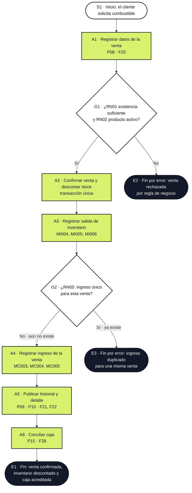
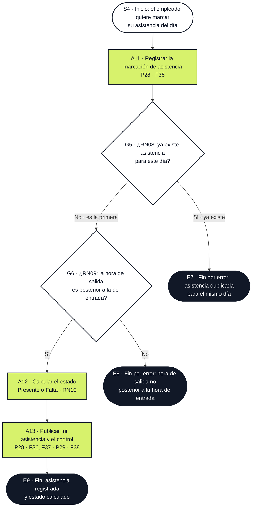

# BPMN · Procesos núcleo y de soporte

Notación **BPMN 2.0 estándar estricta**. Este documento acompaña el punto 5.6 del informe académico y la vista navegable [bpmn.html](bpmn.html).

---

## 1. Diccionario de notación utilizada

Sólo se emplean elementos oficiales de BPMN 2.0. Cada forma se usa con su significado canónico; no hay formas inventadas.

| Elemento | Tipo BPMN 2.0 | Forma estándar | Símbolo usado en este proyecto |
|---|---|---|---|
| Evento de inicio | Evento · *Start Event* | Círculo de **borde fino** | `S1`, `S3`, `S4` |
| Evento de fin | Evento · *End Event* | Círculo de **borde grueso** | `E1`, `E6`, `E9` |
| Evento de fin por error | Evento · *End Event* de tipo *Error* | Círculo grueso relleno | `E2`, `E3`, `E4`, `E5`, `E7`, `E8` (clasificación *Business Rule Violation*) |
| Tarea / actividad | Actividad · *Task* | Rectángulo con esquinas redondeadas | `P1`, `A1`, `A2`, `A3`, `A4`, `A5`, `A6`, `A9`, `A10`, `A11`, `A12`, `A13` |
| Subproceso llamado | Actividad · *Call Activity* | Rectángulo redondeado con **borde doble** | `A7` llama a `SP-INV` |
| Subproceso incorporado | Actividad · *Sub-Process* | Rectángulo redondeado con signo `+` en la base | `SP-INV`, `A8` |
| Puerta de decisión exclusiva | *Gateway* · *Exclusive Gateway* | Rombo con **`X`** dentro | `G1`, `G2`, `G3`, `G4`, `G5`, `G6` |
| Flujo secuencial | *Sequence Flow* | Flecha de trazo continuo | Todo el interior del pool |
| Flujo de mensajes | *Message Flow* | Flecha de trazo **discontinuo** | `M1` (Proveedor ↔ Estación) |
| Pool (participante) | *Participant* | Rectángulo con cabecera lateral | `POOL-CORE`, `POOL-SOPORTE`, `POOL-PROV`, `POOL-ASIST` |
| Carril (lane) | *Lane* | Banda lateral dentro del pool | Operador de turno, Sistema de inventario, Sistema de caja, Publicación y control, Compras, Empleado, Sistema de asistencia |
| Texto de anotación | *Text Annotation* | Texto bajo el elemento | Anotaciones `AN-01`, `AN-02`, `AN-03` |

**Reglas de uso verificables en el diagrama:**

1. Todo proceso tiene **exactamente un** evento de inicio y al menos un evento de fin.
2. Todo evento de fin usa **borde grueso**; el inicio, borde fino.
3. Los rombos llevan siempre `X` (exclusivo) y **etiqueta de salida en cada rama**.
4. Sólo los flujos de mensaje son discontinuos; los de secuencia son continuos.
5. Ninguna tarea se conecta directamente a un evento de fin sin pasar, si hay decisión, por un gateway.
6. Los carriles asignan **responsable único** a cada tarea: una tarea pertenece a un solo carril.

---

## 2. Proceso núcleo · Venta de combustible

**Pool:** `POOL-CORE` — Estación Nexo · Proceso de venta
**Carriles:** Operador de turno · Sistema de inventario · Sistema de caja · Publicación y control



### 2.1 Elementos del proceso núcleo

| ID | Elemento | Tipo | Carril | Contenido / interfaz | Regla |
|---|---|---|---|---|---|
| `S1` | El cliente solicita combustible en el surtidor | *Start Event* | Operador de turno | Inicio del proceso | — |
| `A1` | Registrar datos de la venta | *Task* | Operador de turno | P08 · F20 | — |
| `G1` | ¿Existencia suficiente y producto activo? | *Exclusive Gateway* (`X`) | Operador de turno | Comprobación previa a confirmar | RN01, RN02 |
| `A2` | Confirmar venta y descontar existencias | *Task* | Sistema de inventario | Transacción de negocio | RN01, RN06 |
| `A3` | Registrar salida de inventario | *Task* | Sistema de inventario | `MI004`–`MI006` · P14 · F19 | RN01 |
| `G2` | ¿Ya existe ingreso para esta venta? | *Exclusive Gateway* (`X`) | Sistema de caja | Evita duplicidad de ingreso | RN05 |
| `A4` | Registrar ingreso económico de la venta | *Task* | Sistema de caja | `MC003`–`MC005` · P15 · F28 | RN05, RN06 |
| `A5` | Publicar historial y detalle de la venta | *Task* | Publicación y control | P09 · F21, P10 · F22 | — |
| `A8` | Conciliar caja del día | *Sub-Process* | Publicación y control | P15 · F28 · apertura + ingresos − egresos | RN04, RN05 |
| `E1` | Fin: venta confirmada | *End Event* (borde grueso) | — | — | — |
| `E2` | Fin por error: venta rechazada en `G1` | *End Event* de tipo *Error* | — | — | RN01 / RN02 |
| `E3` | Fin por error: ingreso duplicado en `G2` | *End Event* de tipo *Error* | — | — | RN05 |

**Secuencia de flujos:** `S1 → A1 → G1`; rama «Sí» `→ A2 → A3 → G2`; rama «No» `→ E2`; en `G2` rama «No · aún no existe» `→ A4 → A5 → A8 → E1`, rama «Sí · ya existe» `→ E3`.

**Anotación `AN-01`.** El gateway `G2` implementa la regla RN05: la rama «Sí · ya existe» existe precisamente para impedir el segundo ingreso (`E3`). Es la representación del *caso de violación* documentado en [05_reglas_negocio.md](05_reglas_negocio.md); `E2` es la representación del caso de violación de RN01/RN02.

---

## 3. Proceso de soporte · Compra y abastecimiento

**Pools:** `POOL-PROV` — Proveedor de combustible (actor externo) · `POOL-SOPORTE` — Estación Nexo · Proceso de abastecimiento
**Carriles de `POOL-SOPORTE`:** Compras · Sistema de inventario · Sistema de caja · Publicación y control

```mermaid
flowchart TB
  classDef start fill:#ffffff,stroke:#111827,stroke-width:2px,color:#111827;
  classDef endn fill:#111827,stroke:#111827,stroke-width:4px,color:#ffffff;
  classDef task fill:#d7f26c,stroke:#111827,stroke-width:2px,color:#111827;
  classDef call fill:#ffffff,stroke:#111827,stroke-width:3px,color:#111827;
  classDef subp fill:#ffffff,stroke:#111827,stroke-width:2px,color:#111827;
  classDef gw fill:#ffffff,stroke:#111827,stroke-width:2px,color:#111827;

  subgraph POOL-PROV["POOL · Proveedor (actor externo)"]
    P1["P1 · Emitir y remitir la factura<br/>de la compra"]:::task
  end

  subgraph POOL-SOPORTE["POOL · Estación Nexo · Abastecimiento"]
    S3(["S3 · Inicio: reposición de combustible"]):::start
    A6["A6 · Registrar la compra con sus líneas<br/>P20 · F13"]:::task
    G3{"G3 · ¿RN06: litros y precios<br/>válidos?"}:::gw
    A7["A7 · Crear entradas por línea<br/>MI001, MI002, MI003"]:::call
    SPINV["SP-INV · Subproceso: contabilizar<br/>inventario en litros · P14 · F19"]:::subp
    G4{"G4 · ¿RN04: ya existe<br/>egreso de esta compra?"}:::gw
    A9["A9 · Registrar el egreso único<br/>MC001 · P15 · F28"]:::task
    A10["A10 · Publicar detalle de la compra<br/>P21 · F15"]:::task
    E6(["E6 · Fin: inventario incrementado<br/>y egreso registrado"]):::endn
    E4(["E4 · Fin por error: compra<br/>con valores no válidos"]):::endn
    E5(["E5 · Fin por error: egreso<br/>duplicado de la compra C001"]):::endn
  end

  S3 --> A6
  P1 -. "M1 · Message Flow" .-> A6
  A6 --> G3
  G3 -- "Sí" --> A7 --> SPINV --> G4
  G4 -- "No · es el primero" --> A9 --> A10 --> E6
  G4 -- "Sí · ya existe" --> E5
  G3 -- "No" --> E4
```

### 3.1 Elementos del proceso de soporte

| ID | Elemento | Tipo | Carril | Contenido / interfaz | Regla |
|---|---|---|---|---|---|
| `S3` | Necesidad de reposición de combustible | *Start Event* | Compras | Inicio del proceso | — |
| `A6` | Registrar la compra con sus líneas | *Task* | Compras | P20 · F13 · `Compra` + `DetalleCompra` | RN06 |
| `M1` | Mensaje: factura del proveedor | *Message Flow* (discontinuo) | Proveedor ↔ Compras | Flujo entre pools distintos | — |
| `G3` | ¿Litros y precios válidos? | *Exclusive Gateway* (`X`) | Compras | Validación de cantidades e importes | RN06 |
| `A7` | Crear entradas por línea recibida | *Call Activity* (borde doble) | Sistema de inventario | `MI001`–`MI003` · P12 · F16 | RN04, RN06 |
| `SP-INV` | Subproceso: contabilizar inventario | *Sub-Process* | Sistema de inventario | P14 · F19 · suma al stock por producto | RN01, RN04 |
| `G4` | ¿Ya existe egreso de esta compra? | *Exclusive Gateway* (`X`) | Sistema de caja | Evita duplicidad de egreso | RN04 |
| `A9` | Registrar el egreso único de la compra | *Task* | Sistema de caja | `MC001` · P15 · F28 | RN04, RN06 |
| `A10` | Publicar detalle de la compra y sus efectos | *Task* | Publicación y control | P21 · F15 | RN04 |
| `E4` | Fin por error: compra con valores no válidos en `G3` | *End Event* de tipo *Error* | — | — | RN06 |
| `E5` | Fin por error: egreso duplicado en `G4` | *End Event* de tipo *Error* | — | — | RN04 |
| `E6` | Fin: inventario incrementado y egreso registrado | *End Event* (borde grueso) | — | — | — |

**Secuencia de flujos:** `S3 → A6`; `M1` (flujo de mensaje desde `P1`) `→ A6`; `A6 → G3`; rama «Sí» `→ A7 → SP-INV → G4`; en `G4` rama «No · es el primero» `→ A9 → A10 → E6`, rama «Sí · ya existe» `→ E5`; en `G3` rama «No» `→ E4`.

**Anotación `AN-02`.** `A7` y `A9` son **obligatoriamente consecutivas y de aparición única** por RN04: la compra es el único punto del negocio donde nacen a la vez un movimiento físico (litros) y uno económico (soles). El gateway `G4` materializa el *caso de violación* (dos egresos para una misma compra).

---

## 4. Proceso de asistencia · Marcación y control

**Pool:** `POOL-ASIST` — Estación Nexo · Proceso de asistencia
**Carriles:** Empleado · Sistema de asistencia · Publicación y control



### 4.1 Elementos del proceso de asistencia

| ID | Elemento | Tipo | Carril | Contenido / interfaz | Regla |
|---|---|---|---|---|---|
| `S4` | El empleado quiere marcar su asistencia del día | *Start Event* | Empleado | Inicio del proceso | — |
| `A11` | Registrar la marcación de asistencia | *Task* | Empleado | P28 · F35 · `Asistencia` + `Empleado` | RN07, RN08, RN10 |
| `G5` | ¿Ya existe asistencia para este día? | *Exclusive Gateway* (`X`) | Sistema de asistencia | Evita duplicar la marcación diaria | RN08 |
| `G6` | ¿La hora de salida es posterior a la de entrada? | *Exclusive Gateway* (`X`) | Sistema de asistencia | Comprobación de las horas marcadas · `hora_salida > hora_entrada` | RN09 |
| `A12` | Calcular el estado (Presente o Falta) | *Task* | Sistema de asistencia | Estado derivado de las horas · P28 · F36 | RN10 |
| `A13` | Publicar mi asistencia y el control del personal | *Task* | Publicación y control | P28 · F36, F37 · P29 · F38 | RN07, RN08, RN10 |
| `E7` | Fin por error: asistencia duplicada en `G5` | *End Event* de tipo *Error* | — | — | RN08 |
| `E8` | Fin por error: horas no válidas en `G6` | *End Event* de tipo *Error* | — | — | RN09 |
| `E9` | Fin: asistencia registrada y estado calculado | *End Event* (borde grueso) | — | — | — |

**Secuencia de flujos:** `S4 → A11 → G5`; en `G5` rama «No · es la primera» `→ G6`, rama «Sí · ya existe» `→ E7`; en `G6` rama «Sí» `→ A12 → A13 → E9`, rama «No» `→ E8`.

**Anotación `AN-03`.** RN07 hace que «Mi asistencia» (P28) sólo muestre las marcaciones del usuario autenticado, sin selector de empleado: Ana Torres ve las suyas y no las de los demás. RN10 hace que el estado *Presente* o *Falta* se calcule a partir de las horas marcadas; no se elige a mano. Datos del corte: Ana Torres 10/09/2026 08:00–17:00 *Presente*, Luis Rojas 10/09/2026 08:00–17:00 *Presente* y Elena Díaz 10/09/2026 08:15–17:00 *Presente*; en «Mi asistencia» de Ana se ven además 09/09/2026 07:58–17:00 *Presente* y 08/09/2026 sin marcación (*Falta*).

---

## 5. Correspondencia con el resto del proyecto

El proyecto completo, al corte del 10/09/2026, tiene **30 interfaces (P01–P30)**, **38 funcionalidades (F01–F38)**, **12 entidades** (incluida `Asistencia`) y **10 reglas de negocio (RN01–RN10)**; la maqueta tiene **31 archivos HTML en la raíz** más esta vista navegable `documentacion/bpmn.html`.

| Proceso | Elementos | Funcionalidades | Interfaces | Reglas | Entidades |
|---|---|---|---|---|---|
| Núcleo · Venta | 1 inicio, 5 tareas, 1 subproceso, 2 gateways, 3 fin | F18, F19, F20, F21, F22, F28 | P08, P09, P10, P14, P15 | RN01, RN02, RN05, RN06 | Venta, DetalleVenta, Producto, MovimientoInventario, MovimientoCaja, ConceptoMovimiento |
| Soporte · Compra | 1 inicio, 1 flujo de mensaje, 4 tareas, 1 call activity, 1 subproceso, 2 gateways, 3 fin | F13, F15, F16, F19, F28 | P12, P14, P15, P20, P21 | RN04, RN06 | Compra, DetalleCompra, Producto, MovimientoInventario, MovimientoCaja, ConceptoMovimiento |
| Asistencia · Marcación | 1 inicio, 3 tareas, 2 gateways, 3 fin | F35, F36, F37, F38 | P28, P29 | RN07, RN08, RN09, RN10 | Asistencia, Empleado |

**Conciliación de los datos del ejemplo con los tres procesos:**

| Hecho en la maqueta (corte 10/09/2026 12:00) | Elemento BPMN | Interfaz |
|---|---|---|
| Compra `C001`, 300 L, S/ 1,350.00, Petroandes S.A. | `A6` → `A7` → `A9` | P20, P21 |
| Entradas `MI001`, `MI002`, `MI003` (100 L c/u) | `A7`, `SP-INV` | P12, P14 |
| Egreso `MC001` por S/ 1,350.00 | `A9` | P15 |
| Ventas `V001`, `V002`, `V003` (80 L / S/ 370.00) | `A1`, `A2` | P08 |
| Salidas `MI004`, `MI005`, `MI006` | `A3` | P14 |
| Ingresos `MC003`, `MC004`, `MC005` (S/ 50.00, 120.00, 200.00) | `A4` | P15 |
| Consulta de solo lectura de ingresos y egresos de caja: F26 lee los ingresos y F27 los egresos | Lectura de `A4` y de `A9` | P16 |
| Asistencia del 10/09/2026: Ana Torres 08:00–17:00, Luis Rojas 08:00–17:00 y Elena Díaz 08:15–17:00, todo *Presente* | `A11` → `A12` → `A13` | P28, P29 |
| «Mi asistencia» de Ana: 09/09/2026 07:58–17:00 *Presente* y 08/09/2026 sin marcación (*Falta*) | `A12`, `A13` | P28 |
| Saldo de caja S/ 3,430.00 = 4,410.00 + 370.00 − 1,350.00 | `A8` | P15 |

---

## 6. Autocontrol de notación

| Comprobación | Resultado |
|---|---|
| ¿Todo proceso tiene un inicio y al menos un fin? | Sí · `S1`/`E1`,`E2`,`E3`, `S3`/`E4`,`E5`,`E6` y `S4`/`E7`,`E8`,`E9` |
| ¿Eventos de fin con borde grueso? | Sí · los nueve; los seis de error van rellenos |
| ¿Gateways exclusivos marcados con `X` y etiqueta en cada rama? | Sí · `G1` a `G6` (doce ramas rotuladas) |
| ¿Flujos de mensaje discontinuos y sólo entre pools? | Sí · `M1`, de `POOL-PROV` a `POOL-SOPORTE` |
| ¿Cada tarea en un único carril? | Sí · las doce *Task*, la *Call Activity* `A7` y los dos *Sub-Process* |
| ¿Existe un camino del inicio a un fin sin saltos? | Sí · se listan las secuencias completas en 2.1, 3.1 y 4.1 |
| ¿Uso de formas no definidas en BPMN 2.0? | Ninguno |
