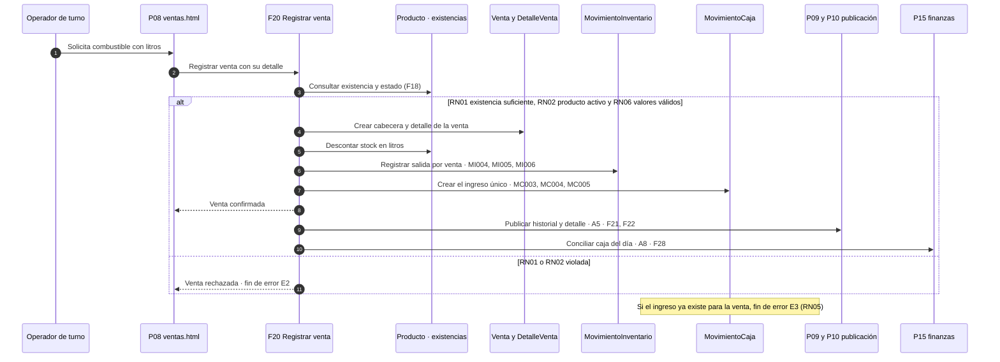
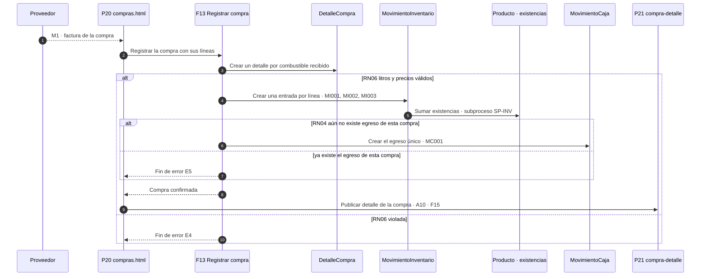
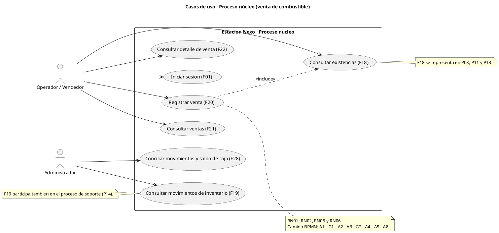
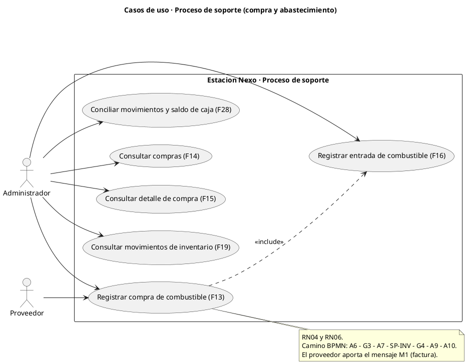

# 5.10 · Productos y entregables

Fuente: `recurso/Proyecto Estructura_v2 (1).pdf`, punto **5.10 Productos y entregables**. El documento oficial pide seis entregables y exige presentar los diagramas «en alguna herramienta basada en código, por ejemplo https://www.plantuml.com/». Este documento no vuelve a crear lo que ya existe: los enlaza en su fuente, sin duplicar documentación.

---

## 1. Inventario de los seis entregables oficiales

| # | Exigencia oficial | Dónde vive | Estado |
|---|---|---|---|
| 1 | Diagrama entidad-relación de la solución de base de datos | [02_modelo_entidad_relacion.md](02_modelo_entidad_relacion.md) §Diagrama ER (Mermaid) | **Entregado** |
| 2 | Diccionario de datos de todo el modelo (semántica de cada entidad y sus atributos) | [02_modelo_entidad_relacion.md](02_modelo_entidad_relacion.md) §cada entidad + §Condiciones de diseño futuro; resumen en la sección 3 de este documento | **Entregado** |
| 3 | Diagramas de secuencia del proceso core y del proceso de soporte | Sección 4 de este documento (Mermaid `sequenceDiagram`) | **Entregado** |
| 4 | Diagramas de casos de uso del proceso core y del proceso de soporte | Sección 5 de este documento (PlantUML) | **Entregado** |
| 5 | Patrones de desarrollo usados y su respectiva implementación (capturas de los patrones revisados en el curso) | Sección 6 de este documento | **Parcial** — patrones del proyecto con extractos de código; las *capturas de los patrones revisados en clase* son **PENDIENTE humano** |
| 6 | Cronograma del proyecto | Sección 7 de este documento | **Parcial** — fases reales ordenadas; las fechas del ciclo son **PENDIENTE humano** |

Bibliografía a revisar exigida junto a este punto (Coronel/Morris/Rob; Cervantes Maceda, Velasco-Elizondo y Castro Careaga): registrada como pendiente en [14_bibliografia.md](14_bibliografia.md).

---

## 2. Diagrama entidad-relación (entregable 1)

Vive en [02_modelo_entidad_relacion.md](02_modelo_entidad_relacion.md) y se dibuja con **Mermaid `erDiagram`** (herramienta basada en código). Contiene:

- Las **11 entidades** oficiales del modelo validado: `Categoria`, `Producto`, `Compra`, `DetalleCompra`, `Empleado`, `Usuario`, `Venta`, `DetalleVenta`, `MovimientoInventario`, `ConceptoMovimiento`, `MovimientoCaja`.
- Claves **PK** y **FK** declaradas en cada entidad y listadas en las tablas de atributos.
- Las **14 relaciones con cardinalidad** (`1:N`, `1:0..1`), incluida la relación `Categoria 1:N Producto` que sustenta el vínculo categoría → combustible exigido por la especificación.
- Ninguna entidad ni atributo nuevo: el diagrama es el mismo que auditan [06_matriz_funcionalidades_interfaces.md](06_matriz_funcionalidades_interfaces.md) y [07_trazabilidad.md](07_trazabilidad.md).

---

## 3. Diccionario de datos (entregable 2)

La semántica de cada entidad y de cada atributo está en las tablas de [02_modelo_entidad_relacion.md](02_modelo_entidad_relacion.md) (una fila por atributo: clave, condición y descripción). Los tipos de dato están declarados en el bloque Mermaid del mismo documento y los dominios y restricciones en su sección *Condiciones de diseño futuro*. Resumen medido del diccionario completo:

| Entidad | Atributos | PK | FK | Interfaces asociadas |
|---|---:|---|---|---|
| Categoria | 4 | `id_categoria` | — | P05 |
| Producto | 7 | `id_producto` | `id_categoria` | P06, P07 |
| Compra | 6 | `id_compra` | `id_usuario` | P20 |
| DetalleCompra | 6 | `id_detalle_compra` | `id_compra`, `id_producto` | P20, P21 |
| Empleado | 7 | `id_empleado` | — | P18 |
| Usuario | 6 | `id_usuario` | `id_empleado` | P02, P19 |
| Venta | 5 | `id_venta` | `id_usuario` | P08 |
| DetalleVenta | 6 | `id_detalle` | `id_venta`, `id_producto` | P08, P09, P10 |
| MovimientoInventario | 7 | `id_movimiento_inventario` | `id_producto`, `id_usuario` | P12, P13, P14 |
| ConceptoMovimiento | 4 | `id_concepto` | — | P17 |
| MovimientoCaja | 9 | `id_movimiento_caja` | `id_concepto`, `id_usuario`, `id_venta`, `id_compra` | P15, P16 |
| **Total** | **67** | 11 PK | 14 FK | 11/11 entidades con interfaz |

---

## 4. Diagramas de secuencia (entregable 3)

Herramienta: **Mermaid `sequenceDiagram`** (código, renderizado por GitHub y VS Code). Son *diagramas de comportamiento* como pide la bibliografía oficial (Cervantes Maceda, «Diagrama de comportamiento — Diagrama de secuencia»). Especifican el flujo previsto para la etapa Spring Boot: **en esta maqueta no se ejecutan**; los participantes, mensajes y alternativas usan sólo IDs existentes.

### 4.1 Proceso núcleo · Venta de combustible

Equivalente a `POOL-CORE` de [09_bpmn.md](09_bpmn.md): `S1 → A1 → G1 → A2 → A3 → G2 → A4 → A5 → A8 → E1` con los fin de error `E2` y `E3`.



| Mensaje | Funcionalidad | Interfaz | Regla | Entidad | Elemento BPMN |
|---|---|---|---|---|---|
| Registrar datos de la venta | F20 | P08 | — | Venta, DetalleVenta | `A1` |
| Consultar existencia y estado | F18 | P08 | RN01, RN02 | Producto | `G1` |
| Confirmar venta y descontar existencias | F20 | P08 | RN01, RN06 | Producto | `A2` |
| Registrar salida · MI004–MI006 | F20 (origen) · F19 (consulta) | P08, P14 | RN01 | MovimientoInventario | `A3` |
| Crear ingreso único · MC003–MC005 | F20 (origen) · F28 (consulta) | P08, P15 | RN05, RN06 | MovimientoCaja | `A4`, `G2` |
| Publicar historial y detalle | F21, F22 | P09, P10 | — | Venta, DetalleVenta | `A5` |
| Conciliar caja del día | F28 | P15 | RN04, RN05 | MovimientoCaja, ConceptoMovimiento | `A8` |
| Venta rechazada | — | P08 | RN01, RN02 | — | `E2` |
| Ingreso duplicado | — | P08 | RN05 | — | `E3` |

La columna *Funcionalidad* distingue el origen del efecto: las salidas (`A3`) y el ingreso (`A4`) los origina la venta F20 y se **consultan** como F19 (P14) y F28 (P15), exactamente como los enlaza [09_bpmn.md](09_bpmn.md). Los códigos de evento de error corresponden a los casos de violación de RN01/RN02 (`E2`) y RN05 (`E3`) y se muestran en la interfaz que originó la transacción.

### 4.2 Proceso de soporte · Compra y abastecimiento

Equivalente a `POOL-SOPORTE` y `POOL-PROV` de [09_bpmn.md](09_bpmn.md): `S3 → A6 → G3 → A7 → SP-INV → G4 → A9 → A10 → E6` con los fin de error `E4` y `E5` y el flujo de mensaje `M1`.



| Mensaje | Funcionalidad | Interfaz | Regla | Entidad | Elemento BPMN |
|---|---|---|---|---|---|
| Factura del proveedor | F13 | P20 | — | Compra | `M1` |
| Registrar compra con líneas | F13 | P20 | RN06 | Compra, DetalleCompra | `A6` |
| Crear entradas por línea · MI001–MI003 | F16 | P12 | RN04, RN06 | MovimientoInventario | `A7` (call activity) |
| Sumar existencias | F19 | P14 | RN01, RN04 | Producto | `SP-INV` |
| Crear egreso único · MC001 | F13 (origen) · F28 (consulta) | P20, P15 | RN04, RN06 | MovimientoCaja | `A9`, `G4` |
| Publicar detalle de la compra | F15 | P21 | RN04 | Compra, DetalleCompra | `A10` |
| Fin de error por valores no válidos | — | P20 | RN06 | — | `E4` |
| Fin de error por egreso duplicado | — | P20 | RN04 | — | `E5` |

La columna *Funcionalidad* vuelve a separar origen y consulta: el egreso lo origina la compra F13 y se consulta como F28 en P15, como enlaza [09_bpmn.md](09_bpmn.md). `E4` y `E5` son los casos de violación de RN06 y RN04.

---

## 5. Diagramas de casos de uso (entregable 4)

Herramienta: **PlantUML** (la citada literalmente por el documento oficial). Los bloques `@startuml … @enduml` se pegan en <https://www.plantuml.com/plantuml/uml> para obtener el diagrama; también los resuelven las extensiones PlantUML de VS Code. Los casos de uso **son funcionalidades existentes** (se escribe su código `Fnn`); no se crean casos nuevos.

### 5.1 Proceso núcleo · Venta de combustible



### 5.2 Proceso de soporte · Compra y abastecimiento



**Correspondencia de los dos diagramas:**

| Diagrama | Casos de uso (funcionalidades) | Actores | Reglas | Entidades |
|---|---|---|---|---|
| Núcleo | F01, F18, F19, F20, F21, F22, F28 | Operador / Vendedor, Administrador | RN01, RN02, RN04, RN05, RN06 | Venta, DetalleVenta, Producto, MovimientoInventario, MovimientoCaja, ConceptoMovimiento |
| Soporte | F13, F14, F15, F16, F19, F28 | Administrador, Proveedor | RN01, RN04, RN06 | Compra, DetalleCompra, Producto, MovimientoInventario, MovimientoCaja, ConceptoMovimiento |

Los casos de uso fuera de estos dos procesos (catálogo F04–F12, finanzas manuales F23–F27, personal F29–F32, tablero F03) pertenecen a los módulos de soporte administrativo y están completos en [04_funcionalidades.md](04_funcionalidades.md) y en la matriz de [06_matriz_funcionalidades_interfaces.md](06_matriz_funcionalidades_interfaces.md): el punto 5.10 pide los dos procesos, no el inventario total.

---

## 6. Patrones de desarrollo usados (entregable 5)

| Patrón | Qué resuelve | Dónde se usa en Estación Nexo | Implementación / evidencia | Estado |
|---|---|---|---|---|
| **Modelo-Vista-Controlador (MVC)** | Separar datos, presentación y lógica | Modelo: las 11 entidades de [02_modelo_entidad_relacion.md](02_modelo_entidad_relacion.md); Vista: 22 HTML + `css/estilos.css`; Controlador: los F01–F32 que ejecutará Spring | Estructura del repositorio (README sección 11) y estados DEFINIDA / MAQUETADA / IMPLEMENTADA | **Parcial:** Modelo y Vista definidos; Controlador pendiente de la etapa Spring |
| **Plantilla compartida (partial / include)** | Un mismo menú y pie en todas las páginas sin duplicar decisiones | Los 22 HTML usan el mismo `<nav>` con el mismo orden de módulos y el mismo `<footer>` | Extracto de `dashboard.html` (idéntico en las páginas internas, con `aria-current="page"` en la activa) | **Usado** en la maqueta |
| **Design tokens (variables CSS)** | Tokens de color compartidos por todos los componentes | La paleta `:root` de `css/estilos.css` gobierna botones, tarjetas y gráficos | Extracto de `css/estilos.css` | **Usado** en la maqueta |
| **Repository / Service (capas)** | Separar acceso a datos y lógica transaccional | Definido para registrar compra (F13) y venta (F20) aplicando RN01–RN06 en una sola transacción | README sección 16 «Próxima etapa con Spring Boot» (Spring Data JPA, servicios transaccionales) | **Definido, no implementado** en esta etapa |

**Extracto 1 — design tokens (`css/estilos.css`):**

```css
:root{
  --ink:#173c36;
  --muted:#657773;
  --paper:#f3f6f3;
  --line:#dce5dd;
  --lime:#d7f26c;
  --green:#226555;
  --white:#fff
}
```

**Extracto 2 — plantilla compartida (`dashboard.html`, mismo bloque en las páginas internas):**

```html
<nav aria-label="Navegación principal">
  <a href="index.html">Inicio</a>
  <a href="dashboard.html" aria-current="page">Dashboard</a>
  <a href="categorias.html">Categorías</a>
  <a href="combustibles.html">Combustibles</a>
  <!-- …enlaces restantes en el mismo orden: Compras, Inventario, Ventas,
       Finanzas, Empleados, Usuarios, Contacto, Cerrar sesión… -->
</nav>
```

> **[PENDIENTE — decisión humana]** el punto 5.10 pide además «capturas explicativas de los patrones revisados en el curso». El material de clase (diapositivas y prácticas de patrones) no está en el repositorio: **no se inventa** ni se sustituye por capturas ajenas. Al recibir ese material, esta sección debe añadir las capturas y, si el curso revisó otros patrones (por ejemplo de catálogo de patrones de Arquitectura de Software), incorporarlos con su implementación en Spring Boot.

---

## 7. Cronograma del proyecto (entregable 6)

Las fases siguen el orden real del trabajo realizado y del que queda. **Las fechas (semana de inicio, fecha de exposición y cierre del ciclo) no existen en el repositorio y no se inventan.**

| # | Fase | Entregable / evidencia | Estado | Fecha |
|---|---|---|---|---|
| 1 | Levantamiento de requisitos del material oficial | Rúbrica de Avance 1 y estructura del proyecto leídas y traducidas a controles | Ejecutado | Sin registrar en el repositorio |
| 2 | Modelo de negocio y modelo entidad-relación | [01_modelo_negocio.md](01_modelo_negocio.md), [02_modelo_entidad_relacion.md](02_modelo_entidad_relacion.md) | Ejecutado | Sin registrar en el repositorio |
| 3 | Definición de interfaces, funcionalidades y reglas | [03](03_interfaces.md), [04](04_funcionalidades.md), [05](05_reglas_negocio.md) | Ejecutado | Sin registrar en el repositorio |
| 4 | Matriz bidimensional y trazabilidad | [06](06_matriz_funcionalidades_interfaces.md), [07](07_trazabilidad.md) | Ejecutado | Sin registrar en el repositorio |
| 5 | Maquetación de las 21 interfaces (HTML5 + CSS3 + Bootstrap) | 22 archivos HTML navegables + `css/estilos.css` | Ejecutado | Sin registrar en el repositorio |
| 6 | BPMN núcleo y de soporte | [09_bpmn.md](09_bpmn.md), [bpmn.html](bpmn.html) | Ejecutado | Sin registrar en el repositorio |
| 7 | Documentación 5.1–5.8 y auditoría | [08_puntos_1_al_5_8.md](08_puntos_1_al_5_8.md), [00_auditoria.md](00_auditoria.md) | Ejecutado | Sin registrar en el repositorio |
| 8 | Cierre de 5.9–5.15 | Este documento, los puntos 5.11–5.14 y [15_anexos.md](15_anexos.md) | Ejecutado | 01/10/2026 |
| 9 | Revisión del equipo y compilación del informe (A4, Arial 11) | Informe final con carátula, integrantes y glosario en plantilla | Pendiente | **PENDIENTE (equipo)** |
| 10 | Exposición Avance 1 | Presentación oral y respuesta de preguntas técnicas | Pendiente | **PENDIENTE (equipo)** |
| 11 | Etapa Spring Boot (fuera del Avance 1) | Implementación de F01–F32 y validación de RN01–RN06 | Pendiente | **PENDIENTE (equipo)** |

---

## 8. Herramienta basada en código

El documento oficial exige presentar los diagramas «en alguna herramienta basada en código, por ejemplo PlantUML». Este proyecto usa dos, ambas de código y sin interfaces gráficas de dibujo:

| Diagrama | Herramienta | Cómo se visualiza |
|---|---|---|
| Entidad-relación (02) | Mermaid `erDiagram` | Render automático en GitHub y VS Code |
| BPMN (09) | Mermaid `flowchart` con formas canónicas BPMN 2.0 | Render automático en GitHub y VS Code |
| Secuencia (este documento, §4) | Mermaid `sequenceDiagram` | Render automático en GitHub y VS Code |
| Casos de uso (este documento, §5) | PlantUML | Pegar el bloque en plantuml.com o usar la extensión PlantUML de VS Code |

Ninguna herramienta añade JavaScript al repositorio: son bloques de texto dentro de Markdown.

---

## 9. Autocontrol de trazabilidad

| Comprobación | Resultado |
|---|---|
| ¿Se usaron sólo IDs existentes? | Sí · todos los códigos F, P, RN y entidades citados en este documento existen en los HTML y en la matriz (verificado por el control 8 de [00_auditoria.md](00_auditoria.md)) |
| ¿Se crearon funcionalidades, interfaces, reglas o entidades nuevas? | No · siguen siendo 32 F, 21 P, 6 RN y 11 entidades |
| ¿Los diagramas de secuencia cubren compra y venta como exige el BPMN? | Sí · §4.2 refleja `A6, G3, A7, SP-INV, G4, A9, A10` con `E4/E5`; §4.1 refleja `A1, G1, A2, A3, G2, A4, A5, A8` con `E2/E3` |
| ¿Los casos de uso corresponden a procesos reales? | Sí · núcleo = proceso de venta; soporte = proceso de abastecimiento (los dos de [09_bpmn.md](09_bpmn.md)) |
| ¿Algún entregable se inventó fuera de la especificación? | No · las seis filas de la sección 1 son textualmente las del punto 5.10 oficial |
| ¿Qué queda en pendiente humano? | Capturas de los patrones revisados en clase y fechas del cronograma (sección 6 y 7) |
